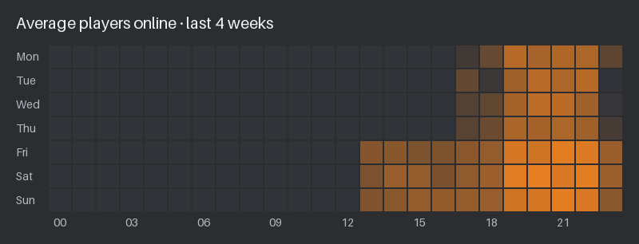
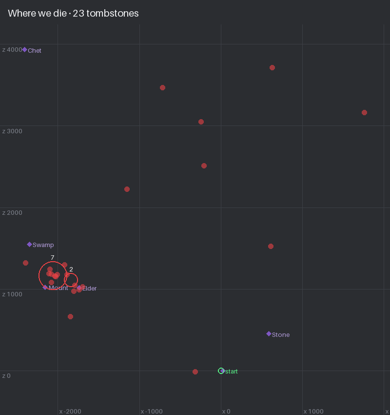

# Valheim → Discord monitor (no mods)

Posts Valheim server activity to a Discord channel without installing anything
on the game server, so Steam achievements keep working. Two modes:

| Mode | Needs | Events |
|---|---|---|
| **Count mode** (`a2s` or `steamapi`) | Only the server's IP — polls the Steam query port (game port + 1), or Steam's master server via the Web API when that port is firewalled | player joined / left (count only), server online / offline |
| **Log mode** (`lowms`, `nexus`, `ftp`, `sftp`, `file`, `http`) | Read access to `valheim_console.log` — on LOW.MS via the public API (`lowms`) | named **login**, **logout**, **death**, respawn, **refused joins** |

Log mode is the one you want: names and deaths. On LOW.MS use the `lowms`
source: the public API now serves the console with a plain API key (no FTP/SFTP
exists there, and the older `nexus` source had to sign in to the panel as you). Count mode is the fallback for hosts where nothing else
works — note the Steam-based sources report a stale count on crossplay
servers, because relayed players never register with Steam.

Python 3.9+, no third-party packages for the core monitor. Optional extras: SFTP
(`paramiko`) and the Discord admin bot (`discord.py`, see `requirements.txt`).

On top of the Discord posts it can also, with the optional **admin bot**:
- **Alert you when someone is refused** by your ban or permitted list, with **Permit** /
  **Ban** buttons and who the player is (their Discord member and other characters). The
  player gets a DM explaining why, and so does anyone on the wrong game version
  ([join-attempt alerts](#join-attempt-alerts--discord-admin-bot)).
- **Organise your Discord** into Valheim-themed channels with one command, previewed first
  and undoable ([server setup](#server-setup-odin-setup)).
- Show **who's online** and the server's numbers in locked voice channels at the top of
  the channel list: names online, join code, uptime, this week's stats and every title
  holder ([stat channels](#stat-channels)). A single [status channel](#status-voice-channel)
  or a live [status board](#status-board) message also work.
- Answer **`/valheim join`** for anyone: the current join code, the address and how to
  connect ([commands](#discord-commands)).
- **Restart and update the server** from Discord with a countdown warning, and post when a
  Valheim update is waiting or installed ([auto-updates](#auto-updates-and-restarts-from-discord)).
- **Change world settings** (preset, modifiers, setkeys) from Discord, checked on the
  server before anything is written ([world settings](#auto-updates-and-restarts-from-discord)).
- **Community:** `/muninn stats` and `/muninn top`, DMs when friends come online, an
  "In Valheim" role, weekly **title roles** for the leaderboard leaders (Heimdall, Hel,
  Sleipnir, Thor, Bragi, Hœnir, Mímir, Völundr), an **Odin** role for the server owner, game nights with a
  planning thread, reminders and **time polls**, a "when do people play" heatmap, a world
  map link, play streaks, a yearly
  **server birthday** post, and a smoother first join
  ([players & community](#players--community), [roles & names](#roles--names)).
- **Server health:** warnings before the save disk fills up or saves get slow, and an
  optional daily restart while nobody's on ([server health](#server-health)).
- **Steam achievements in Discord:** unlock posts, achievements in `/muninn stats`, a
  leaderboard and the Bragi title, with a free Steam API key
  ([achievements](#steam-achievements-in-discord)).
- **Boss progress, read from the world save:** "⚔️ Moder has fallen!" when a boss goes
  down, `/muninn bosses`, and a "🏆 Bosses: 3/8 · next: Moder" channel. No mods and no
  setup ([boss progress](#boss-progress)).
- **Portals and tombstones, from the world save too:** `/muninn portals` finds portals that
  go nowhere, `/muninn tombstones` the gear nobody has picked up yet, with where to find it
  ([portals and tombstones](#portals-and-tombstones)). `/muninn ships` finds every boat, and
  `/muninn tames` every tamed animal and its name ([ships and tames](#ships-and-tames)), and
  `/muninn builders` who built the most, with a **Völundr** title ([builders](#builders-muninn-builders)),
  and `/muninn deathmap` where everyone keeps dying ([death map](#death-map-muninn-deathmap)).
- **Achievement progress from a character file:** players upload their `.fch` with
  `/valheim progress` and see which achievements they're still missing. Those who opt in
  join a `/muninn progress` board, with the **Mímir** title for the leader and a post when
  someone finishes a list. Run it without a
  file for a guide to finding it on Windows, Linux, Steam Deck or macOS
  ([achievement progress](#achievement-progress-valheim-progress)).
- **Honors for what the logs can't see:** 16 built-in roles like Hermóðr (crypt raider),
  Andhrímnir (cook) and Gangleri (explorer), plus your own. Admins give them directly, by
  vote or as a bounty prize ([honors](#honors)).
- **Bounties and join-to-create voice:** admin challenges with a week-long Skadi role for
  the winner, and a voice channel that makes each member their own
  ([bounties](#bounties), [join-to-create](#join-to-create-voice-channels)).
- **Restore a world backup** from Discord with `/odin restore`, undoable
  ([restore](#restoring-a-backup-odin-restore)).
- **`/valheim wiki`:** a card from the Valheim Wiki for any item, creature, boss or biome,
  with the stats that matter ([wiki lookup](#wiki-lookup-valheim-wiki)).
- **Valheim patch notes** in #runestone whenever Iron Gate releases a patch, and
  `/valheim patch-notes` for the latest. No setup ([patch notes](#valheim-patch-notes)).

And without the bot:
- **Raid alerts, version-mismatch alerts, session summaries, first-visit welcomes,
  milestones and a weekly recap** ([extras](#extras-raids-summaries-milestones-recap-board-backups)).
- **Copy Valheim's world backups to another disk** ([backup copies](#world-backup-copies)).
- **Keep a permanent copy of the server log**, which Valheim wipes on every restart, so
  stats can always be rebuilt ([log archive](#the-log-archive)).
- Keep **play stats** in SQLite and publish a leaderboard page, with players' **Steam
  achievements**.
- Run **unattended updates and nightly backups** on LOW.MS.

**Running the Valheim server on your own Linux machine?** Start with the
[self-hosted quick start](#self-hosted-linux-server-quick-start).

**What's new** (already running it? `git pull && docker compose up -d --build`):
- **`/muninn find <item>` and `/muninn stock`:** where is the iron? `find` searches every
  chest, barrel, cart, ship and tombstone in the world and says how many are where, next to
  which sign or portal. `stock` adds up everything the server owns. Read from the world save;
  personal chests stay private ([find and stock](#find-and-stock-muninn-find-muninn-stock)).
- **Error messages are private everywhere:** when a command that answers in public (like
  `/muninn builders` or `/muninn when`) fails or can't find the world save, only the person
  who ran it sees the message; the channel doesn't get a stray "Something went wrong"
  ([when a command fails](#discord-commands)).
- **`/odin progress-remove <character>`:** admins take a character off the progress board
  without needing its file; the characters on the board are suggested as you type
  ([the progress board](#the-progress-board-muninn-progress)).
- **Fixes from a third code audit**, of everything added lately ([details](#about-this-fork)):
  - **Progress board:** a character linked to someone is theirs. Nobody else can put it on
    the board by renaming a file, its player can take over an entry someone else made, and
    admins can remove any entry. A list added in an update is no longer announced as
    "finished".
  - **Patch notes:** an empty reply from Steam on the very first check no longer makes the
    next check repost old patches.
  - **Wiki:** a wrongly capitalised lookup no longer hides the right page for hours, the
    suggestions no longer get stuck at one entry, and errors stay private with `share:True`.
  - **World save:** tombstones and builders are no longer lost if the database is busy for
    a moment, two commands at once no longer scan twice, and a command run during a save no
    longer fails.
  - **Death map:** a tombstone floating in water is counted once.
  - **Weekly digest:** ships that stayed put aren't reported as moved, carts don't count as
    ships, several tombstones of one player are told apart, and a recap that's retried
    still compares with last week.
  - **Smaller things:** a server first visited on 29 February gets its birthday on the 28th
    in other years, and there's no 🏆 Bosses channel when boss progress is off.
- **`/muninn deathmap`:** a map of where people die, built up from every tombstone the world
  saves show, with your portals for bearings and the worst spots circled and listed with
  coordinates. `player:` for one character ([death map](#death-map-muninn-deathmap)).
- **Fixed: `/muninn builders` (and portals, tombstones, ships, tames) not answering** the first
  time they ran after a world save. Any command that fails now answers with a short message
  instead of staying on "thinking…".
- **"This week in the world" in the weekly recap:** pieces built and who built most, new and
  removed portals, ships built, lost or moved, tombstones recovered or left behind, and tames
  gained, compared with last week's world save. It starts with the second recap after
  updating ([the world digest](#this-week-in-the-world)).
- **Builders board and the Völundr title:** `/muninn builders` ranks everyone by the pieces
  they've placed that are still standing, read from the world save. The top builder gets
  **Völundr**, the master smith of legend, with the other titles each week
  ([builders](#builders-muninn-builders)).
- **`/muninn when`:** a heatmap of when people usually play, by weekday and hour, with the
  busiest hours and the best time for a game night. `player:` shows when one character is
  usually on ([when people play](#when-people-play-muninn-when)).
- **Ships and tames, from the world save:** `/muninn ships` lists every raft, karve, longship
  and drakkar (and cart) with where it is, furthest first, so the boat left on a far shore
  turns up. `/muninn tames` counts the tamed wolves, boars, lox, chickens and asksvin, and
  lists the named ones with their stars and where they are
  ([ships and tames](#ships-and-tames)).
- **Portals and tombstones, read from the world save:** `/muninn portals` lists portals whose
  name has no partner (they go nowhere), names used three or more times, and portals without
  a name. `/muninn tombstones` shows every tombstone nobody has emptied yet: whose, which day
  they died and where. No mods, no setup ([portals and tombstones](#portals-and-tombstones)).
- **`/valheim wiki`:** look up any item, creature, boss, biome, building or dungeon on the
  Valheim Wiki without leaving Discord: a card with the summary, the key stats (health,
  weaknesses, drops, materials, food values…) and a link. Suggestions appear as you type
  ([wiki lookup](#wiki-lookup-valheim-wiki)).
- **The Day channel is right from the start:** ☀️ Day now comes from the world save too, so it
  shows the real day as soon as the bot starts, instead of "after the next sleep", and keeps
  counting on nights nobody sleeps through ([stat channels](#stat-channels)).
- **Streaks and the server's birthday:** `/muninn stats` shows each player's current and best
  play streak (days in a row), `/muninn top streak` ranks the longest streaks, and on the
  day the server turns 100 days old, then every year, Huginn posts a birthday look-back:
  vikings, hours, deaths, who set sail first and who played most
  ([streaks and the birthday](#streaks-anniversaries-and-the-servers-birthday)).
- **Progress board:** `/valheim progress board:True` puts your counts (never the lists) on
  `/muninn progress`, a leaderboard for everything or one list. The leader gets the
  **Mímir** title, and Huginn posts "🎣 Ingrid has caught every fish!" when someone finishes
  a list. Opt-in, and `board:False` takes you off
  ([the progress board](#the-progress-board-muninn-progress)).
- **Valheim patch notes:** when Iron Gate releases a patch, the bot posts its notes in
  #runestone (formatted, with a link to the full notes on Steam), and `/valheim patch-notes`
  shows the latest one to anyone. On by default; it starts with the next patch
  ([patch notes](#valheim-patch-notes)).
- **Everything stays in step:** at each start the bot updates the channel topics it set
  (now listing every `/muninn` and `/warcouncil` command), the channel guide and the pinned
  command guides. The Hall of Champions gains **Óðr** (who's away) and **Skadi** (this week's
  bounty hunters), and `/muninn titles` lists the bounty hunters too
  ([server setup](#server-setup-odin-setup)). A test and a checklist now keep the README,
  topics, guides and stat channels in step with every new feature
  ([keeping everything consistent](#keeping-everything-consistent)).
- **`/valheim progress`:** upload your character file (`.fch`) and see which achievements
  you're still missing (crafting, building, cooking, kills, bosses, fish, trophies, ways
  to die), with a full list to download and an optional summary to share
  ([achievement progress](#achievement-progress-valheim-progress)).
- **Honors:** roles for what the logs can't see, like the crypt raider, the cook, the
  builder or the explorer. 16 come built in (Hermóðr, Andhrímnir, Freyr, Gangleri…), admins
  hand them out directly, by a vote or as a bounty prize, and can make their own, silly ones
  welcome ([honors](#honors)).
- **Two more roles** with the titles: **Hœnir** for the least time played (among players
  seen this month with 10+ minutes played), and **Óðr** for everyone who hasn't been on for 14
  days, taken back the moment they log in ([title roles](#title-roles)).
- **A permanent copy of the server log:** Valheim wipes its log on every server start,
  taking the history with it. The monitor now keeps every line it reads in
  `logs_archive/` (one file a day, gzipped), and `--backfill` reads it, so stats can always
  be rebuilt ([log archive](#the-log-archive)).
- **Pinned command guides:** each command group's channel gets a pinned list of its
  commands (`/valheim` in #the-gates, `/muninn` in #muninns-roost, `/warcouncil` in
  #war-council, `/odin` in the admin channel). Already set up? Run
  `/odin setup action:guides` once; they update themselves after that.
- **No lost history on an old server:** the first time the monitor starts with an empty
  stats database, it loads every log still on the server (rotated and `.gz` copies too),
  without posting anything. `--backfill` can now be run again safely to fill gaps
  ([catching up on old logs](#catching-up-on-old-logs)).
- **#runestone gets used:** `/odin announce` posts there by default (or in Huginn's feed,
  or both), `/odin rules` keeps one pinned rules post (with a starter set to edit), and
  with `"runestone_news": true` big news (a Valheim update, a restore, a boss kill) is kept
  there too ([the rules channel](#the-rules-channel-runestone)).
- **Restart warnings and restore notices always post**, even without `"update"` in
  `events`, since an admin started them.
- **Fixes from a second code audit** ([details](#about-this-fork)):
  - "come join" and "first player online" DMs now arrive (they never fired);
  - a player who reconnects is no longer mixed up with the next one to join;
  - `/muninn uptime` counts crashes;
  - a failed `/odin restore` can't leave the server on an empty world;
  - muting in the join-to-create lobby no longer makes extra channels;
  - `/odin announce` says when a post failed.

  With `/odin restore` set up, install the host script again:
  `sudo install -o valheim -g valheim -m 755 host/valheim-bot-request.sh /home/valheim/valheim-bot-request.sh`.
- **Boss progress:** the bot reads which bosses are down straight from the world save (no
  mods), posts "⚔️ Moder has fallen!" when a new one falls, and shows it in
  `/muninn bosses` and a "🏆 Bosses: 3/8 · next: Moder" stat channel
  ([boss progress](#boss-progress)).
- **`/odin restore`:** put the world back to one of Valheim's backups from Discord. It
  asks first, keeps the current world as a backup (so it can be undone), and needs a
  one-time host step ([restore setup](#restoring-a-backup-odin-restore)).
- **Join-to-create voice:** join **➕ Raise a longship** and the bot makes you your own
  voice channel ("⛵ Ingrid's longship"), deleted once everyone leaves
  ([join-to-create](#join-to-create-voice-channels)).
- **Bounties:** admins post challenges with `/odin bounty` ("Kill Moder without dying");
  members press **🎯 I did it**, an admin confirms, and the winner is **Skadi** for a week
  ([bounties](#bounties)).
- **A calmer, friendlier feed:** **quiet hours** hold joins and leaves overnight and post
  them as one summary in the morning, a **digest** groups a burst of joins into one post,
  and milestones now include **play streaks** ("5-day streak 🔥") and **anniversaries**
  ([feed options](#quiet-hours-and-digests)).
- **New commands:** `/muninn compare` (two characters side by side), `/muninn uptime`
  (how much the server was up, and restarts) and `/odin announce` (post as Huginn, optionally
  pinging @everyone). There's also an `uptime_week` [stat channel](#stat-channels).
- **"Come join" DMs:** `/valheim notify crowd 3` DMs you when 3 players are on. And the bot
  can **DM new Discord members** a welcome with how to join (`welcome_dm`, opt-in).
- **Commands are split into four groups:** `/valheim` (join, map, link, notify…),
  `/muninn` (stats, top, titles, online), `/warcouncil plan` and `/odin` (admin, hidden from
  members). Each group can be limited to its channel in Discord's settings
  ([commands](#discord-commands)).
- **Commands have a home channel:** `/muninn stats` in the general chat gets a private
  "run it in #🪶┃muninns-roost" instead of cluttering the chat
  ([commands](#discord-commands)).
- **Game nights get a thread and time polls** ("sat 20:00, sun 18:00" → a vote, then a
  signup). The **weekly recap gets a chart**, the bot **reacts** to raids, welcomes and
  titles, `/odin setup` **pins the guide** and sets the **AFK channel**, handled admin
  notices are **tidied**, and `/valheim link` can set **nicknames** (opt-in).
- **[Bot permissions](#bot-permissions):** the full list, with what each one is for, the
  ones to leave off, and ready-made invite links.
- **The bot handles Huginn's webhook:** `/odin setup` moves it into #huginns-watch, or
  creates it on a fresh install, and the bot warns you at start-up if it posts into the
  private admin channel ([server setup](#server-setup-odin-setup)).
- **Discord's own join messages** ("Yay you made it, …") no longer end up hidden in the
  private admin channel: `/odin setup` moves them to #the-gates
  ([server setup](#server-setup-odin-setup)).
- **Refused-join notices say who it is** (the linked Discord member, other characters on that
  account), and the player gets a DM explaining why. Players on the wrong game version get a
  DM too. The stat channels gain **☀️ Day 142**
  ([join alerts](#join-attempt-alerts--discord-admin-bot), [stat channels](#stat-channels)).
- **"In Valheim" no longer gets stuck.** The monitor remembers who's online across restarts
  and rebuilds, and every 5 minutes the bot takes the role from anyone who isn't in the
  game. Roles already stuck clear on their own after updating
  ([details](#players--community)).
- **`/odin setup`:** organises your whole Discord into Valheim-themed categories and
  channels (The Gates, The Mead Hall, The Wilds, The Longhouses, Odin's Seat). It previews
  first, never deletes anything, and can be undone ([server setup](#server-setup-odin-setup)).
- **Stat channels:** three bot-made categories of locked voice channels: Heimdall's Watch
  (who's online by name, join code, uptime, saves, backups, disk), The Saga (this week's
  numbers, next game night) and the Hall of Champions (Odin and every title holder). Your
  status channel moves in, and the status board isn't needed any more:
  `"stat_channels": {"enabled": true}` ([stat channels](#stat-channels)).
- **Steam achievements in Discord:** unlock posts from Huginn, achievements in
  `/muninn stats`, a "Most achievements" board in `/muninn top`, and a fifth title role,
  **Bragi**. No web page needed ([details](#steam-achievements-in-discord)).
- **[Roles & names](#roles--names):** one overview of the bot (Muninn), the announcer
  (Huginn), and every role the bot hands out.
- **Sleipnir replaces Huginn** as the "most visits" title. The bot renames the existing
  role, so nothing to do ([title roles](#title-roles)).
- **The bot creates the "In Valheim" role** with `"online_role": true`, instead of you
  making it and copying its ID ([players & community](#players--community)).
- **Odin, the server owner's role:** `"owner_role": true` gives the Discord server's owner
  an "Odin" role near the top of the member list ([players & community](#players--community)).
- **Title roles:** the leader of each `/muninn top` board gets a Norse role (Heimdall,
  Hel, Sleipnir, Thor, Bragi), reassigned weekly. Turn on with `"titles": {"enabled": true}`
  ([title roles](#title-roles)).
- **`/valheim map` works with Valheim 1.0 worlds.** It reads the seed from the world
  folder (`worlds_local/<world>/_main.<N>.fwl2`); set `admin_bot.map.seed` if it can't
  ([players & community](#players--community)).
- **Community commands:** `/muninn stats`, `top`, `notify`, `link`, `request-access`,
  `plan` and `map`, plus an optional "In Valheim" role
  ([players & community](#players--community)).
- **Server health:** low-disk and slow-save warnings, and an optional daily restart while
  nobody's on ([server health](#server-health)).
- **World settings from Discord:** `/odin settings`, `preset`, `modifier`, `setkey`
  ([host/README.md](host/README.md#world-settings-from-discord-preset-modifiers-setkeys)).
- **`/valheim join`** and a status board with the join code, uptime, version, last save,
  backup and raid ([status board](#status-board)).
- **Secrets belong in `.env`.** If your webhook URL or bot token is in `config.json`, move
  it ([keeping secrets safe](#keeping-secrets-safe)).

**Contents:**
- **Getting started:** [Self-hosted quick start](#self-hosted-linux-server-quick-start) ·
  [Keeping secrets safe](#keeping-secrets-safe) ·
  [Count mode](#count-mode-quick-start) · [Log mode](#log-mode)
- **Admin bot:** [Join alerts & setup](#join-attempt-alerts--discord-admin-bot) ·
  [All Discord commands](#discord-commands) · [Status channel](#status-voice-channel) ·
  [Stat channels](#stat-channels) · [Server setup](#server-setup-odin-setup) ·
  [Players & community](#players--community) · [Boss progress](#boss-progress) ·
  [Portals & tombstones](#portals-and-tombstones) · [Ships & tames](#ships-and-tames) · [Builders](#builders-muninn-builders) · [Death map](#death-map-muninn-deathmap) ·
  [Achievement progress](#achievement-progress-valheim-progress) · [Patch notes](#valheim-patch-notes) · [Wiki lookup](#wiki-lookup-valheim-wiki) · [When people play](#when-people-play-muninn-when) · [Honors](#honors) · [Bounties](#bounties) · [Join-to-create voice](#join-to-create-voice-channels) ·
  [Title roles](#title-roles) ·
  [Roles & names](#roles--names) ·
  [Testing](#testing-it) ·
  [Troubleshooting](#troubleshooting)
- **Extras:** [Raids, summaries, milestones, recap](#extras-raids-summaries-milestones-recap-board-backups) ·
  [This week in the world](#this-week-in-the-world) ·
  [Streaks & the server's birthday](#streaks-anniversaries-and-the-servers-birthday) ·
  [Status board](#status-board) · [Backup copies](#world-backup-copies) ·
  [Restoring a backup](#restoring-a-backup-odin-restore) ·
  [Server health](#server-health) ·
  [Auto-updates, restarts & world settings](#auto-updates-and-restarts-from-discord)
- **Stats & LOW.MS:** [Stats page](#player-stats--public-web-page) ·
  [Catching up on old logs](#catching-up-on-old-logs) · [Log archive](#the-log-archive) ·
  [Steam achievements](#steam-achievements) ([in Discord](#steam-achievements-in-discord)) ·
  [Updates & backups (LOW.MS)](#unattended-updates--nightly-backups-lowms)
- **Reference:** [Running it permanently](#running-it-permanently) · [Options](#options) ·
  [Server admin tips](#server-admin-tips) · [Development](#development) ([keeping it consistent](#keeping-everything-consistent)) ·
  [About this fork](#about-this-fork)

## Self-hosted Linux server (quick start)

This is the setup for a dedicated server you run yourself, e.g. installed with the
[Pi My Life Up guide](https://pimylifeup.com/valheim-dedicated-server-linux/):
- a `valheim` user
- the server in `/home/valheim/valheimserver`, run by the systemd unit `valheimserver.service`
- `-savedir /home/valheim/valheim_save_data`

The monitor runs in Docker on the same machine. It tails the server's log file and,
if you enable the admin bot, edits the ban and permitted lists in the save dir.

1. **Have the server write its log to a file.** Add `-logFile` to the `ExecStart` line
   in `/etc/systemd/system/valheimserver.service`:
   ```
   ExecStart=/home/valheim/valheimserver/valheim_server.x86_64 … -savedir /home/valheim/valheim_save_data -logFile /home/valheim/logs/valheim_console.log
   ```
   Then create the folder and restart the server:
   ```bash
   sudo -u valheim mkdir -p /home/valheim/logs
   sudo systemctl daemon-reload && sudo systemctl restart valheimserver
   ```
   To check what your server actually uses: `systemctl cat valheimserver | grep ExecStart`.
   If your `-savedir` or log path differs, remap it in `docker-compose.override.yml` with
   the same container path, e.g. `- /srv/valheim/logs:/logs:ro`. Compose replaces a mount
   when the override uses the same target.
2. **Get the code and configure it:**
   ```bash
   git clone https://github.com/alainator/valheim-discord-monitor.git
   cd valheim-discord-monitor
   cp config.selfhosted.example.json config.json
   cp .env.example .env && chmod 600 .env
   ```
   - In `config.json`, set `server_name`.
   - In `.env`, set `DISCORD_WEBHOOK_URL` (channel → Edit Channel → Integrations →
     Webhooks → New Webhook → Copy Webhook URL) and `TZ`. Using the admin bot? You can
     leave the webhook out: [`/odin setup`](#server-setup-odin-setup) creates one in
     the right channel.
   - If you don't want the admin bot yet, set `admin_bot.enabled` to `false`.
     Otherwise follow [Setting up the bot](#setting-up-the-bot).

   Keep secrets in `.env` rather than `config.json`. Both files are git-ignored, but a
   `grep` or a pasted snippet of `config.json` can easily leak a token. See
   [keeping secrets safe](#keeping-secrets-safe).
3. **Start it:**
   ```bash
   docker compose up -d --build
   docker compose logs -f
   ```
   A healthy start logs `Monitoring file source for <your server>; posting [...]`,
   plus `; admin bot on` and `admin_bot: connected as …` if the bot is enabled.

**Your own folders go in `docker-compose.override.yml`**, next to `docker-compose.yml`.
Docker Compose merges it in automatically, and git ignores it, so `git pull` never
conflicts with your changes. Leave `docker-compose.yml` as it comes from the repo. For
example:
```yaml
services:
  valheim-discord-monitor:
    volumes:
      - /mnt/backups/valheim:/backups           # backup copies
      - /home/valheim:/valheim_home:ro          # updater log + world settings
      - /home/valheim/bot:/bot                  # restart / settings requests
```
Check the result with `docker compose config | grep -E "source:|target:"`.

**Updating:** `git pull && docker compose up -d --build`.

**After editing `config.json` or `.env`:** `docker compose up -d --force-recreate`. The
monitor reads its settings only at start-up.

**Looking inside `/home/valheim`:** that folder is private to the `valheim` user. Use
`sudo`, and wrap wildcards in `sudo sh -c '…'`. Otherwise your own shell expands the
`*` before `sudo` runs and reports "No such file":
```bash
sudo sh -c 'ls -la /home/valheim/valheim_save_data/*list.txt'
```
The container runs as root, so it can read and edit those files anyway.

**Next steps**, each optional:
1. [Set up the admin bot](#setting-up-the-bot): refused-join alerts and the slash commands.
2. Organise your Discord with [`/odin setup`](#server-setup-odin-setup): themed
   channels, previewed first and undoable.
3. Turn on the bot-made [stat channels](#stat-channels) (`"stat_channels": {"enabled": true}`)
   and the [roles](#roles--names).
4. Turn on the [extras](#extras-raids-summaries-milestones-recap-board-backups): raids,
   summaries, milestones, weekly recap. They're just names in `events`.
5. [Copy world backups](#world-backup-copies) to another disk.
6. Link your update script and world settings ([host/README.md](host/README.md)) for
   `/odin restart`, update posts and `/odin modifier`.

### Keeping secrets safe

Two values give control of your Discord channel to anyone who has them:
- **The webhook URL** (`DISCORD_WEBHOOK_URL`): anyone with it can post to the channel.
- **The bot token** (`DISCORD_BOT_TOKEN`): anyone with it can act as your bot.

Keep both in `.env` only:
- `.env` wins over `config.json`: when `DISCORD_WEBHOOK_URL` or `DISCORD_BOT_TOKEN` is
  set there, `webhook_url` / `admin_bot.token` in `config.json` are ignored.
- `.env` and `config.json` are git-ignored, so neither is committed. Keep it that way.
  The same goes for `webhook.json`, where the bot keeps a webhook it created.
- When asking for help, share `config.json` without the secrets, and never paste `.env`.
  To check that a token is loaded without printing it, use the
  [length check](#troubleshooting) instead.

**Moving a secret out of `config.json`:**
1. Add it to `.env`, with no quotes and no spaces around `=`:
   ```
   DISCORD_WEBHOOK_URL=https://discord.com/api/webhooks/…
   ```
2. In `config.json`, delete the whole `"webhook_url": "…",` line (or `"token": "…",` in
   `admin_bot`). If it was the last line in its block, also delete the comma at the end
   of the line above it. Check with `python3 -m json.tool config.json > /dev/null`.
3. `docker compose up -d --force-recreate`, then `docker compose logs --tail 20`. No
   `No Discord webhook URL configured` error means it was picked up.

**If one has leaked** (pasted in a chat, a screenshot, an issue, a commit), replace it.
The old one keeps working until you do:
- **Webhook:** the channel → Edit Channel → Integrations → Webhooks → select it →
  **Delete Webhook**. Create a new one, copy its URL into `.env`, and recreate the
  container.
- **Bot token:** [Discord developer portal](https://discord.com/developers/applications)
  → your app → Bot → **Reset Token**. Put the new token in `.env` and recreate the
  container. The old token stops working immediately.

## Count mode (quick start)

1. Check the query port answers from wherever the monitor will run:
   ```bash
   python a2s_probe.py YOUR.SERVER.IP          # prints "name — 2/10 players (v0.220.5 …)"
   ```
   Valheim's query port is the game port + 1 (2456 → 2457). **No reply?** The
   host is firewalling UDP queries (LOW.MS does). Use the `steamapi` source
   instead — see below.
2. Create a Discord webhook (channel → Edit Channel → Integrations → Webhooks).
3. `cp config.example.json config.json`, fill in `host` and `webhook_url`.
4. `python valheim_discord_monitor.py --test-webhook`, then
   `python valheim_discord_monitor.py`.

The monitor polls every `poll_interval_seconds` (10 s by default; the example configs use 15), posts when the
count changes, and marks the server offline after `offline_after` consecutive
failed queries (3 default) so a single dropped packet doesn't cause a false
alarm. Nothing is posted on start-up. Messages use `{who}` ("A viking" / "2
vikings"), `{count}`, `{max}` and `{server}` placeholders.

### `steamapi` — when the query port is firewalled

The game server sends its player count to Steam's master server itself
(outbound heartbeats), so Steam can tell you the count even when nothing
inbound reaches the server. Two requirements:

1. The server is set **Public** in your host's panel (on LOW.MS: Manage →
   General → Public Server). This only lists it in the community browser; the
   password still applies.
2. A free Steam Web API key from <https://steamcommunity.com/dev/apikey>
   (any domain name will do).

Config:
```json
"source": { "type": "steamapi", "host": "YOUR.SERVER.IP", "game_port": 2456, "api_key": "..." }
```
or leave `api_key` out and set the `STEAM_API_KEY` environment variable.
Check it with `python valheim_discord_monitor.py --probe`. Steam refreshes
its listing on the server's heartbeat, so counts can lag a minute or so.

Limitations: A2S carries no names (Valheim returns an empty player list) and no
death information. **Crossplay servers:** both `a2s` and `steamapi` see only
players who connected directly through Steam, so with crossplay on the count
stays frozen — use the `nexus` source instead. Two players swapping within one poll interval shows as no
change.

## Log mode

Vanilla Valheim already prints everything needed to `valheim_console.log`
(on LOW.MS: **Files → game → valheim_console.log**). From your server:

| Event   | Log line |
|---------|----------|
| Login   | `Got character ZDOID from Bjorn : 1234567890:67` (first non-zero ZDOID for a name) |
| Death   | `Got character ZDOID from Bjorn : 0:0` |
| Respawn | next non-zero ZDOID for that name |
| Logout  | `Destroying abandoned non persistent zdo … owner 1234567890` (owner id matches the player), or `Closing socket …` on direct-Steam servers, or `Player disconnected … now 0 player(s)` |
| Refused join | `Player Stranger : V_7656… is blacklisted or not in whitelist.` (see [admin bot](#join-attempt-alerts--discord-admin-bot)) |
| Restart / online | `OnApplicationQuit` / `ZNet Shutdown` … then `Game server connected` |

The monitor tails the log by byte offset, so its own restarts never re-post. It runs the
lines through a small state machine and posts an embed to a Discord webhook. When the game
server restarts and starts a fresh log, the monitor notices and reads the new log from the
top. For local files that works even if the new log is already longer than the old one,
e.g. when the monitor was down during the restart.

### Setup

1. **Discord webhook** — in your Discord server: channel → Edit Channel →
   Integrations → Webhooks → New Webhook → Copy Webhook URL.
2. Copy `config.example.json` to `config.json`, paste the webhook URL and set
   `server_name`.
3. Pick a log source (below) and fill in the `source` block.
4. Test:
   ```bash
   python valheim_discord_monitor.py --test-webhook        # posts a hello to Discord
   python valheim_discord_monitor.py --replay sample_console.log   # parser dry-run, prints events
   ```
5. Run it:
   ```bash
   python valheim_discord_monitor.py --config config.json
   ```
   Secrets can be given as environment variables instead of in the file. With Docker
   Compose, put them in `.env`:

   | Variable | Replaces |
   |---|---|
   | `DISCORD_WEBHOOK_URL` | `discord.webhook_url` |
   | `DISCORD_BOT_TOKEN` | `admin_bot.token` |
   | `STEAM_API_KEY` | `steam.api_key` / `source.api_key` (steamapi) |
   | `LOWMS_API_KEY` | `source.api_key` (lowms) / `maintenance.api_key` |
   | `NEXUS_EMAIL`, `NEXUS_PASSWORD`, `NEXUS_TOKEN` | the `nexus` source / panel login |
   | `VALHEIM_LOG_USER`, `VALHEIM_LOG_PASSWORD` | `source.user` / `source.password` (ftp, sftp) |

By default the monitor starts at the **end** of the log (only new events post).
Use `--from-start` once if you want it to replay the existing file.

### Log sources

#### `ftp`
For hosts that offer FTP. Set `host`, and `path` to the console log (on
LOW.MS it is `game/valheim_console.log`; the layout may put it under a
`<ip>_<port>/` directory — run discovery to find out):

```bash
python valheim_discord_monitor.py --config config.json --discover
```
This walks the FTP tree and prints every `*.log` / `*console*` file with its size.
Set `"tls": true` if the host requires FTPS.

LOW.MS's Nexus panel does not offer FTP/SFTP (confirmed with their support,
Sept 2026). Use the `lowms` source there.

#### `lowms` (LOW.MS public API — recommended on LOW.MS)
The documented [LOW.MS public API](https://api.prod.nexus.low.ms/v1/docs) reads the
console directly:

```json
"source": { "type": "lowms", "server_id": "YOUR-SERVER-UUID", "lines": 300 },
"events": ["login", "logout", "death", "server_restart", "server_online", "server_offline"]
```

Create a key under Panel → Account → **API Keys** with the `console:read` scope
(pin it to this server), and put it in `LOWMS_API_KEY` or `source.api_key`. Same log
lines as the `nexus` source below — up to 500 per call instead of 300 — but a stable,
documented endpoint with no browser sign-in, so it can't break when the panel's login
page changes or the account gets an MFA or CAPTCHA challenge. **Prefer this.**

The one thing it can't do is install game updates (the public API has no update
endpoint), so the `maintenance` block's update half needs the `nexus` login;
backups work fine with the key alone.

#### `nexus` (LOW.MS panel — legacy; use `lowms` instead)
The panel's Console tab reads the live log from
`GET https://api.prod.nexus.low.ms/user/servers/<id>/daemon/console?lines=N`
using the panel's own Auth0 session token (the public `lowms_…` API keys are
rejected there). *Note:* LOW.MS's public API has since added
`GET /v1/servers/{id}/console` (scope `console:read`), which could replace this
browser sign-in for reading the log; the panel session is still needed for game
updates, which the public API doesn't offer. The `nexus`
source signs in to the panel **with your own account** through a headless
browser, captures that token, caches it, and signs in again whenever it
expires or is rejected — so you get the full log, and with it named login /
logout / death events, on a host that offers no file access.

One-time setup on the machine that runs the monitor:
```bash
pip install playwright
python3 -m playwright install --with-deps chromium     # needs sudo for the system deps
```
Config:
```json
"source": {
  "type": "nexus",
  "server_id": "YOUR-SERVER-UUID",
  "lines": 300,
  "login": { "email": "you@example.com", "password": "…" }
},
"events": ["login", "logout", "death"]
```
Or keep the credentials out of the file with `NEXUS_EMAIL` / `NEXUS_PASSWORD`.
The server id is the UUID in the panel URL. Check it works before starting
the monitor:
```bash
NEXUS_EMAIL=… NEXUS_PASSWORD=… python3 nexus_login.py --server-id YOUR-SERVER-UUID --check
```
That signs in, prints the token expiry, and echoes three console lines. The
token and browser profile live in `~/.valheim-monitor/`; on a login failure a
screenshot and page HTML are dropped there for diagnosis. Two caveats: enabling
MFA on the LOW.MS account will break the automatic sign-in, and this relies on
an internal panel endpoint LOW.MS could change.

#### `file`
For running the monitor on the same machine as the server, or on any log
file you sync locally.

#### `sftp` / `http`
SFTP needs `pip install paramiko`. `http` polls any URL that returns the raw
log text (supports `Range` requests if the server does).

## Join-attempt alerts & Discord admin bot

If the server uses `bannedlist.txt` or `permittedlist.txt`, Valheim turns away anyone
banned or not permitted and logs:

```
Player Stranger : V_76561198000000000 is blacklisted or not in whitelist.
```

Log mode turns that line into a **`join_refused`** event. Nothing is logged when
neither list is in use (nobody gets refused), so you only hear about it when the
lists are doing their job. There are two ways to receive it:

- **Webhook only.** Add `"join_refused"` to `events` and a line like "**Stranger**
  tried to join My Server but isn't allowed in." goes to your normal channel. The
  platform ID isn't included, because that channel is usually public.
- **Admin bot (recommended).** A small Discord bot posts each refusal to a
  **private admin channel** with the player's name, platform ID, Steam profile
  link and why they were refused, plus three buttons:

  | Button | Does |
  |---|---|
  | **Permit** | Removes the ID from `bannedlist.txt` and, if you use a permitted list, adds it to `permittedlist.txt` |
  | **Ban** | Adds the ID to `bannedlist.txt` and removes it from `permittedlist.txt` |
  | **Ignore** | Closes the notice |

  Only the Discord users and roles you list can press them. For IDs you already know,
  there are also slash commands (`/odin permit`, `ban`, `unban`, `unpermit`,
  `lists`). See [all Discord commands](#discord-commands).

  **Permit** never *starts* a permitted list. With an empty `permittedlist.txt`
  the server is open to everyone who isn't banned, and adding the first ID would lock
  everyone else out, so in that case Permit only unbans.

  **Who is it?** The monitor remembers every platform ID (Steam, Xbox, PlayStation,
  Switch) each character has joined with. So the notice also says, when it knows:
  - the **Discord member**, if that account's character is linked (`/valheim link`) or was
    announced with `/valheim request-access`;
  - the **other characters** that account has played as.

  A new name on a known account, or a friend's friend on a new account, is easy to tell
  apart before you click.

  **Tidy:** once someone has pressed Permit, Ban or Ignore, the notice is deleted a day later
  (`tidy_notices_hours`), so Odin's Seat only shows what still needs a decision.

  **The player is told why.** If the bot knows who it is, it DMs them: "Your join to
  Alheim as Frankeem was refused: you're not on the permitted list. The admins have been
  told…". Banned players aren't told. There's at most one DM per player per 30 minutes,
  and the notice says when a DM was sent.

  **Wrong game version.** When someone's game is older or newer than the server's, the
  public channel already gets a note (`version_mismatch` in `events`). If the bot knows who
  it is, from the crossplay handshake's platform ID, it also DMs them: update the game, or
  wait for the server to update.

  **Why not a Steam-verified whitelist?** Some bots let players add themselves using the
  Steam account linked in their Discord profile. Reading that needs Discord's OAuth login,
  and so a public HTTPS website for the login redirect. That's a lot to run next to a game
  server, so this bot keeps the admin in the loop with Permit/Ban and shows who the player
  is instead.

The bot edits the list files directly, so it has to run **on the same machine as
the server** (self-hosted, `file` source) with write access to the save dir. It
writes Steam IDs **in the style your list files already use**. Valheim 1.0's lists say
`V_7656…`, while the same server's log says `Steam_7656…`, so a Permit writes `V_7656…`
to match. Other platforms are written as the server printed them (`X_`, `S_`, `N_`, or
`Xbox_…` etc. on older builds). `V_7656…`, `Steam_7656…` and a bare `7656…` are matched as
the same player. Community docs say list edits apply without a restart
(the next join attempt is checked against the file). If a change doesn't seem to take
effect, `sudo systemctl restart valheimserver`.

### Discord commands

The commands are in four groups, one per place they're used:

| Group | Commands | Where |
|---|---|---|
| **`/valheim`** | `join`, `map`, `link`, `unlink`, `notify`, `request-access`, `progress`, `patch-notes`, `wiki` | Anywhere: the replies are private |
| **`/muninn`** | `stats`, `top`, `titles`, `online`, `when`, `compare`, `uptime`, `bosses`, `honors`, `progress`, `builders`, `deathmap`, `find`, `stock`, `portals`, `tombstones`, `ships`, `tames` | #🪶┃muninns-roost |
| **`/warcouncil`** | `plan`, `bounties` | #🗺️┃war-council and its game-night threads |
| **`/odin`** | `permit`, `ban`, `unban`, `unpermit`, `lists`, `settings`, `modifier`, `preset`, `setkey`, `backups`, `update-check`, `restart`, `restart-cancel`, `setup`, `announce`, `bounty`, `bounty-close`, `restore`, `rules`, `progress-remove`, `honor give/take/create/delete/vote` | Admins, anywhere: replies are private |

**Pinned command guides.** So members know what's there, each group's home channel has a
pinned message listing that group's commands, with their options and what they do:

| Guide | Pinned in |
|---|---|
| `/valheim` (works anywhere, private replies) | #🚪┃the-gates |
| `/muninn` | #🪶┃muninns-roost |
| `/warcouncil` | #🗺️┃war-council |
| `/odin` | the admin channel |

- They're posted by `/odin setup apply`. On a server that's already set up, run
  `/odin setup action:guides` once; it's also how to bring one back if it was deleted.
- They're built from the commands themselves (`<option>` is required, `[option]`
  optional), and the bot updates them at every start-up, so a new command shows up in
  its guide after an update with nothing to do.
- Pinning needs **Pin Messages** in those channels. Without it the guides are still
  posted, just not pinned, and the log says `couldn't pin the … guide`.

**When a command fails**, it always answers, and only the person who ran it sees the
message:
- "Something went wrong with that command. The admins can check the bot's log." means
  something unexpected happened; the reason is in the bot's log:
  `docker compose logs valheim-discord-monitor | grep "failed:"`.
- Expected problems say what's wrong instead, e.g. "I can't find the world save" or "This
  needs the stats database".
- This holds for the commands that answer in public too (`/muninn builders`, `when`,
  `deathmap`…). They show "thinking…" to everyone while they work; if they fail, the
  thinking message is removed and the error goes only to you. Nothing is left in the
  channel.

**Admins:** `/odin` only works for the users and roles in `admin_user_ids` /
`admin_role_ids`. Discord also hides it from anyone without **Manage Server**. If one of
your bot admins doesn't have that permission, allow their role for `/odin` in Server
Settings → Integrations → the bot.

**Keeping commands in their channel.** Two layers:
1. **Discord's own setting** (recommended) removes a group from the `/` menu everywhere
   else. Go to Server Settings → Integrations → the bot, click **`/muninn`** → Channels
   and allow only #🪶┃muninns-roost; do the same for **`/warcouncil`** with
   #🗺️┃war-council. Bots can't change this setting themselves.
2. **The bot's own check**, on by default after [`/odin setup`](#server-setup-odin-setup):
   run in the wrong channel, only you see "Run `/muninn stats` in #🪶┃muninns-roost, please",
   and nothing is posted. Admins can run anything anywhere.
   - Point a command somewhere else with `"command_channels": {"stats": "<channel id>"}`, or
     turn this off with `"command_channels": false`.

**The server owner and anyone with Administrator see every command everywhere.** Discord
doesn't apply per-channel command settings to them, and the bot's own check skips admins
too. So test what members see with a friend or a second account: in #🍺┃mead-hall, typing
`/` should only offer `/valheim`.

| Command | Who | What it does | Needs |
|---|---|---|---|
| `/valheim join` | Anyone | Join code, address, password (spoiler) and how to connect; only the asker sees it | The bot; `admin_bot.join` for the address |
| `/muninn online` | Anyone | Who's on right now, and since when | The bot |
| `/muninn stats [player]` | Anyone | Play time, rank, visits, longest session, deaths, first/last seen, current and best play streak, Steam achievements. No name = your linked character | Stats database |
| `/muninn top [category]` | Anyone | Leaderboard: time played, deaths, visits, longest session, Steam achievements, or longest play streak (days in a row) | Stats database |
| `/muninn compare <player> [other]` | Anyone | Two characters side by side: time played, visits, longest session, deaths, achievements, with the leader of each marked. No `other` = your linked character | Stats database |
| `/muninn bosses` | Anyone | Every boss with ✅ or ⬜, when it fell, and which is next ([boss progress](#boss-progress)) | `save_dir` |
| `/muninn portals` | Anyone | Portals that go nowhere, names used 3+ times, portals without a name, and the connected pairs ([portals](#portals-and-tombstones)) | `save_dir` |
| `/muninn when [player] [weeks]` | Anyone | Heatmap of when people usually play, by weekday and hour, with the best time for a game night; `player` for one character; `weeks` 1–12, default 4 ([details](#when-people-play-muninn-when)) | Stats database |
| `/muninn builders` | Anyone | Who built the most: pieces still standing in the world, per builder ([builders](#builders-muninn-builders)) | `save_dir` |
| `/muninn find <item>` | Anyone | Which chests, barrels, carts, ships and tombstones hold an item, how many, and where (by the nearest sign and portal); items in the world are suggested as you type ([find](#find-and-stock-muninn-find-muninn-stock)) | `save_dir` |
| `/muninn stock` | Anyone | Everything in the chests, barrels, carts and ships, added up ([stock](#find-and-stock-muninn-find-muninn-stock)) | `save_dir` |
| `/muninn deathmap [player]` | Anyone | A map of where people die, from every tombstone seen in a world save, with the worst spots listed ([death map](#death-map-muninn-deathmap)) | `save_dir`, stats database |
| `/muninn ships` | Anyone | Every raft, karve, longship and drakkar, furthest from the start first, and the carts ([ships](#ships-and-tames)) | `save_dir` |
| `/muninn tames` | Anyone | Tamed animals: how many of each, and the named ones with stars and where they are ([tames](#ships-and-tames)) | `save_dir` |
| `/muninn tombstones` | Anyone | Every tombstone nobody has emptied yet: whose, the day they died, and where ([tombstones](#portals-and-tombstones)) | `save_dir` |
| `/muninn honors [member]` | Anyone | Every [honor](#honors) and who holds it, or one member's honors | Stats database |
| `/muninn progress [only]` | Anyone | The [progress board](#the-progress-board-muninn-progress): achievement counts from `/valheim progress` uploads, for everything or one list | Stats database |
| `/muninn uptime` | Anyone | Share of time the server was up this week, the last 7 and 30 days, with restarts and downtime | Stats database |
| `/muninn titles [refresh]` | Anyone (`refresh`: admin) | Who holds each title role; `refresh` reassigns them now | [`titles`](#title-roles) |
| `/valheim notify <when> [player] [players]` | Anyone | DM me when the first player joins an empty server, when `players` are online (`crowd`), or when a given character joins; `off` / `list` | Stats database |
| `/valheim link <character>` / `unlink` | Anyone | Link your Discord account to your character (stats, role, mentions) | Stats database |
| `/valheim request-access <character>` | Anyone | New player: "I'll join as …". The admins' refused-join notice then says who it is | Stats database |
| `/warcouncil plan <title> <when>` | Anyone | Game night with Going / Maybe / Can't buttons, a planning thread and a reminder ping. Several times (`sat 20:00, sun 18:00`) start a poll for the time | Stats database |
| `/warcouncil bounties` | Anyone | Open bounties with their rewards and deadlines, and the top bounty hunters | Stats database |
| `/valheim progress [save] [only] [share] [board]` | Anyone | Upload your character's `.fch` to see the [achievements](#achievement-progress-valheim-progress) you're still missing; `share` posts a summary; `board:True` puts your counts on `/muninn progress` (`False` takes them off). Without a file: a guide to finding it, with a button per platform | — (the board: stats database) |
| `/valheim map` | Anyone | World seed and a map link (spoilers; only the asker sees it) | `save_dir` |
| `/valheim wiki <page> [share]` | Anyone | A card from the Valheim Wiki: summary, key stats and a link ([wiki lookup](#wiki-lookup-valheim-wiki)); only the asker sees it unless `share` | Internet access to the wiki |
| `/valheim patch-notes` | Anyone | The latest Valheim [patch notes](#valheim-patch-notes) from Steam; only the asker sees them | Internet access to Steam |
| `/odin permit <id>` | Admin | Unban, and add to the permitted list if you use one | `save_dir` |
| `/odin ban <id>` | Admin | Ban, and remove from the permitted list | `save_dir` |
| `/odin unban <id>` / `unpermit <id>` | Admin | Remove from one list | `save_dir` |
| `/odin lists` | Admin | Show the permitted, banned and admin lists | `save_dir` |
| `/odin backups` | Admin | Newest backup copies, with size and age | [`backups`](#world-backup-copies) |
| `/odin update-check` | Admin | Check for a Valheim update now | [host helper](host/README.md) |
| `/odin restart [minutes] [reason]` | Admin | Restart (installs any waiting update); warns players at N/5/1 min, early if everyone leaves | [host helper](host/README.md) |
| `/odin restart-cancel` | Admin | Stop a restart countdown | — |
| `/odin restore <backup>` | Admin | Put the world back to one of Valheim's backups (newest first), after a confirmation. The current world is kept as a backup | [host helper](host/README.md#restoring-a-world-backup-from-discord) |
| `/odin bounty <challenge> [reward] [days]` | Admin | Post a [bounty](#bounties) with an **I did it** button; open 7 days by default | Stats database |
| `/odin bounty-close <bounty>` | Admin | Close an open bounty without a winner | Stats database |
| `/odin progress-remove <character>` | Admin | Take a character off the [progress board](#the-progress-board-muninn-progress); the characters on it are suggested as you type | Stats database |
| `/odin announce <message> [title] [ping] [where]` | Admin | Post an announcement in #runestone (default), Huginn's feed, or both; `ping` adds @everyone. `\n` starts a new line ([rules channel](#the-rules-channel-runestone)) | #runestone, or Huginn's webhook |
| `/odin honor give / take / create / delete / vote` | Admin | Hand out [honors](#honors) for deeds the log can't see, make your own, or let everyone vote | Stats database, Manage Roles |
| `/odin rules [text] [show]` | Admin | Post or edit the one pinned rules message in #runestone; no text = a starter set; `show` gives the current text to copy and edit | #runestone |
| `/odin setup [preview\|apply\|undo\|guides]` | Admin | Organise the Discord into themed categories and channels ([server setup](#server-setup-odin-setup)); `guides` only pins the command guides | Manage Channels, Manage Roles (Manage Webhooks for Huginn's webhook, Manage Server for Discord's join messages) |
| `/odin settings` | Admin | Current preset, modifiers and setkeys, and every allowed value | [world settings](host/README.md#world-settings-from-discord-preset-modifiers-setkeys) |
| `/odin modifier <name> <value>` | Admin | Change a modifier, e.g. `raids more`; `normal` resets it | world settings |
| `/odin preset <name>` | Admin | Change the preset; `default` removes it | world settings |
| `/odin setkey <key> on\|off` | Admin | Turn nomap, playerevents, passivemobs or nobuildcost on or off | world settings |

Player IDs look like `V_76561198…` (Steam), `X_…`, `S_…` or `N_…`. World-setting changes
apply at the next restart; the bot offers a "Restart in 5 min" button.

**Buttons:** refused-join notices have **Permit / Ban / Ignore**, and world-setting
confirmations have **Restart in 5 min**. They keep working after the bot restarts.

### Setting up the bot

This takes about five minutes in Discord's developer portal.

**1. Create the bot.**
1. Go to <https://discord.com/developers/applications> → **New Application** → give it a name.
   **Muninn** fits the theme (see [roles & names](#roles--names)).
2. Open **Bot** → **Reset Token** → **Copy**.
3. Put the token in `.env` as `DISCORD_BOT_TOKEN=<token>`: no quotes, no spaces.
   - It must be the token from the **Bot** page: about 70 characters with two dots. The
     **Client Secret** on the OAuth2 page (32 characters, no dots) won't work.
   - Every **Reset Token** click invalidates the previous token.
   - Treat the token like a password; anyone who has it controls the bot.
4. Leave the **Privileged Gateway Intents** off; the bot doesn't need them. (Only for
   [welcome DMs](#players--community): turn on **Server Members Intent**.)
5. Optional: switch off **Public Bot** so nobody else can invite it. If Discord complains,
   first set **Installation** → **Install Link** to **None**.

**2. Invite it.**
1. Open **OAuth2** → **URL Generator**.
2. Under scopes, tick **`bot`** and **`applications.commands`**.
3. Under bot permissions, tick the ones in [Bot permissions](#bot-permissions) below: at
   least the "needed now" list, or everything in both lists so future features work
   without re-inviting.
4. Open the generated URL, pick your Discord server, and click **Authorize**.

Or skip the ticking and use a ready-made link. Replace `YOUR_APP_ID` with the
**Application ID** from the developer portal's General Information page:
- Everything (needed now plus future features):
  `https://discord.com/oauth2/authorize?client_id=YOUR_APP_ID&scope=bot+applications.commands&permissions=2832677918338160`
- Only what's needed now:
  `https://discord.com/oauth2/authorize?client_id=YOUR_APP_ID&scope=bot+applications.commands&permissions=9413151792`

Opening an invite link again for a bot that's already in your server just updates its
permissions; it doesn't add a second bot.

#### Bot permissions

**Needed now**, for every current feature:

| Permission | Used for |
|---|---|
| View Channels | Seeing the channels it works in |
| Send Messages | Admin notices, game nights, the channel guide, the titles post |
| Embed Links | Every notice and stat post is an embed |
| Read Message History | Finding and editing its own earlier messages (guide, signups, status board) |
| Manage Channels | [Stat channels](#stat-channels), the [status channel](#status-voice-channel), [`/odin setup`](#server-setup-odin-setup) |
| Manage Roles | ["In Valheim", Odin, the title roles, the bounty role and the honor roles](#roles--names); channel permissions in `/odin setup` and join-to-create channels |
| Manage Webhooks | Creating Huginn's webhook, or moving it to #huginns-watch |
| Manage Server | Moving Discord's "Yay you made it" join messages (optional) |
| Manage Events | Discord Events for game nights, with `lfg.discord_event` (optional) |
| Connect, Move Members | [Join-to-create voice](#join-to-create-voice-channels): moving people into their new channel (optional) |

**Used by the optional extras** (game-night threads, polls, reactions, the recap chart,
pinning, tidying, nicknames), and harmless to grant now:

| Permission | Would allow |
|---|---|
| Attach Files | The weekly recap's chart (posted by the webhook, which needs no permission; kept for future images) |
| Add Reactions, Use External Emojis | Reacting to Huginn's raid, welcome, milestone and title posts |
| Create Polls | Time polls for game nights, and [honor votes](#honors) |
| Create Public Threads, Send Messages in Threads, Manage Threads | A thread per game night, where the reminder is posted |
| Pin Messages | Pinning the channel guide, the [command guides](#discord-commands) and the [rules](#the-rules-channel-runestone) |
| Manage Messages | Tidying handled refused-join notices |
| Create Events | The newer half of the events permission |
| Manage Nicknames | Setting a member's nickname to their character on `/valheim link` (opt-in) |

**Don't grant:**
- **Administrator.** It overrides everything, and a leaked token would mean full control
  of your server.
- **Kick Members, Ban Members, Moderate Members.** The bot bans from the *game*, not
  Discord.
- **Mention Everyone** server-wide. Only if you want `/odin announce ping:True` to ping in
  #runestone, allow it in that one channel (its settings → Permissions → the bot).

After inviting, keep the bot's role **above** the roles it hands out (In Valheim, Odin,
the titles) in Server Settings → Roles. A private channel's own permissions override the
server-wide ones, so allow the bot there too.

**3. Make a private admin channel.** For example `#valheim-admin`, with Private Channel on.
Then channel settings → **Permissions** → add the bot with View Channel, Send Messages
and Embed Links.

**4. Copy the IDs.** Turn on User Settings → Advanced → **Developer Mode**, then right-click
and **Copy ID** on each of these:

| Right-click | Goes in |
|---|---|
| Your server icon | `guild_id` |
| The admin channel | `channel_id` |
| Yourself | `admin_user_ids` |
| An admin role, if you want a whole role to have access | `admin_role_ids` |

**5. Configure.** Fill in the `admin_bot` block of `config.json` as in
`config.selfhosted.example.json`:
- Keep the IDs as quoted strings.
- `save_dir` is the folder with the list files *as the monitor sees it*. In Docker that's
  `/valheim_save_data`, which `docker-compose.yml` maps to `/home/valheim/valheim_save_data`.
- Check the file is valid JSON: `python3 -m json.tool config.json > /dev/null && echo OK`.

**6. Start.** Run `docker compose up -d --build --force-recreate`, or
`pip install -r requirements.txt` and restart the monitor if you don't use Docker.
- The log shows `admin_bot: connected as …` and the bot turns online in Discord.
- With `guild_id` set, the commands (`/valheim`, `/muninn`, `/warcouncil`, `/odin`) appear
  immediately; without it, they can take up
  to an hour.

A player who keeps retrying triggers only one notice per `repeat_cooldown_seconds`
(10 min).

### Status voice channel

The bot keeps a **voice** channel's **name** showing the server's state, so everyone sees it
in the channel list without opening anything.

**Three features, easy to mix up:**

| Setting | Channel type | What you get |
|---|---|---|
| `status_channel` (this section) | **Voice** channel you make | The channel's *name* changes: `🟢 Valheim: 3 online` |
| [`stat_channels`](#stat-channels) | **Voice** channels the bot makes | Three categories of locked channels: who's online by name, join code, uptime, this week's numbers, title holders… |
| [`status_board`](#status-board) | **Text** channel | One *message* the bot keeps editing, with who's on, version, uptime, last save, backup and raid |

You can use any or all of them. `status_channel` and `status_board` each need their own
channel of the right type; the bot won't rename a text channel (it logs a warning and skips
it). The stat channels need no setup in Discord, and they take over your `status_channel`
(moved into their category, with names), so with them on you need neither of the other two.

**The channel shows one of three names at a time**, whichever matches the server right now:

| Server state | Setting | Default name |
|---|---|---|
| People playing | `online` | `🟢 Valheim: 3 online` (the number follows the player count) |
| Up, nobody on | `empty` | `🟢 Valheim: empty` |
| Down or restarting | `offline` | `🔴 Valheim: offline` |

**Setup:**
1. Create a **voice** channel. Nobody needs to join it: in its permissions, deny
   **Connect** for @everyone so it's just a label.
2. In the same permissions screen, add the bot with **View Channel** and **Manage Channels**.
3. Right-click the channel → **Copy Channel ID**, and add this inside the `admin_bot` block:
   ```json
   "status_channel": { "channel_id": "123456789012345678" }
   ```
   That's all that's required. To change the wording, add any of the three names; you
   only need the ones you want to change:
   ```json
   "status_channel": {
     "channel_id": "123456789012345678",
     "online": "⚔️ {server}: {count} online",
     "empty": "💤 {server}: empty",
     "offline": "🔴 {server}: down"
   }
   ```
   `{count}` is the number online; `{server}` is `server_name`.
4. `docker compose up -d --force-recreate`, then check the log:
   `admin_bot: status channel is '…'; it's renamed when the server's state changes`.

**What to expect:**
- **Nothing happens straight away.** The name only changes when the server's state
  changes: someone joins or leaves, or the server stops or starts. If the name already
  matches, nothing needs doing.
- **At most one rename every 5 minutes.** Discord lets a bot rename a channel only twice
  per 10 minutes. When a change has to wait, the log says when it will happen:
  `status channel: renaming to '🟢 Valheim: empty' at 16:19:45`. A burst of joins and
  leaves in between costs one rename, with the latest count. So a player who joins and
  leaves within a minute can leave the channel saying "1 online" for up to 5 minutes.
- **Restarting the monitor starts the 5-minute wait again,** so avoid recreating the
  container repeatedly while testing.
- **Right after the monitor starts,** the name is left alone until the count is known: the
  next join or leave, or the server's `Connections` log line every 10 minutes.
- **Offline** shows as soon as the server logs a shutdown, or once the log has been silent
  for `stale_after_seconds` (15 min), which catches a crash.
- **Log times are UTC** unless you set `TZ` in `.env`, e.g. `TZ=America/Los_Angeles`.

### Stat channels

Locked voice channels at the top of your channel list whose names show the server's
numbers and title holders. The bot creates, fills and updates them; members can see them
but not join. Each name says what it is, because Discord doesn't allow descriptions on
voice channels or categories.

```
🛡️ HEIMDALL'S WATCH · LIVE
  🟢 3 online: Ingrid, Bjorn, Sigrid
  🟢 Server online · l-1.0.16
  🔑 Join code: 482913
  ⏱ Up 3 d
  ☀️ Day 142
  💾 World saved today 12:04 (1.2 s)
  🗄 Backup: today 04:10
  💽 Disk free: 412 GB
📜 THE SAGA · THIS WEEK
  📈 Peak today: 4
  ⏳ This week: 38 h played
  💀 Deaths this week: 14
  ⚔️ Last raid: The Elder's army (Tue)
  📅 Bonemass run · Sat 20:00
  🧭 23 Vikings have visited
  🏅 312 achievements unlocked
👑 HALL OF CHAMPIONS · TITLES
  🏆 Bosses: 3/8 · next: Moder
  👁️ Odin (server owner): Alain
  🛡️ Heimdall (most hours): Ingrid
  💀 Hel (most deaths): Bjorn
  🐎 Sleipnir (most visits): Sigrid
  ⚡ Thor (longest session): Ingrid
  📜 Bragi (most achievements): Bjorn
  🤫 Hœnir (least hours): Sigrid
  🧠 Mímir (most progress): Ingrid
  🔨 Völundr (most built): Bjorn
  🛶 Óðr (away 14+ days): 2
  🎯 Skadi (bounty hunter): Bjorn
```

| Key | Shows |
|---|---|
| `players` | Who's online, by name ("+2 more" when the names don't fit in 100 characters) |
| `server` | Online / offline and the version; ⬆️ when the updater has found an update |
| `join_code` | The crossplay join code (known after the first join since the last restart) |
| `uptime` | Time since the server started |
| `day` | The in-game day, read from the world save (written every 30 minutes and at shutdown), and from the log when everyone sleeps, whichever is further along. Needs `save_dir` for the save; without it, it waits for the first sleep |
| `saved` | The last world save and how long it took |
| `backup` | When Valheim last made a world backup |
| `disk` | Free space on the save disk |
| `peak_today` | Most players online at once today |
| `hours_week` | Hours played this week (since Monday), all players together |
| `deaths_week` | Deaths this week |
| `uptime_week` | Share of this week the server was up, and restarts ("📶 Up 99.4% this week · 1 restart") |
| `last_raid` | The most recent raid and its day |
| `next_plan` | The next game night from `/warcouncil plan` |
| `vikings` | Characters that have ever played |
| `achievements` | Steam achievements unlocked, all players together |
| `bosses` | Bosses defeated in this world and the next one ("🏆 Bosses: 3/8 · next: Moder"), from the [world save](#boss-progress) |
| `title_owner` | Odin: the Discord server's owner |
| `title_time`, `title_deaths`, `title_sessions`, `title_longest`, `title_achievements`, `title_least`, `title_progress`, `title_builder` | The [title](#title-roles) holders: Heimdall, Hel, Sleipnir, Thor, Bragi, Hœnir, Mímir, Völundr (`titles` means all of them) |
| `away` | Óðr: how many linked players [haven't been on](#title-roles) for a while ("🛶 Óðr (away 14+ days): 2") |
| `bounty_hunter` | Skadi: who holds the [bounty](#bounties) hunter role this week |

**Setup:** add this to the `admin_bot` block, then `docker compose up -d --force-recreate`:
```json
"stat_channels": { "enabled": true }
```
The bot needs **Manage Channels** and `guild_id`. The categories and channels appear
within a minute.

- **Your status channel moves in.** If you have a `status_channel`, it becomes the
  `players` channel: moved into Heimdall's Watch, locked, and renamed with names. Nothing is
  duplicated, and the old status channel updater stops.
- **The status board isn't needed** with these: everything it showed is here. Remove the
  `status_board` line from `config.json` and delete its message or channel.
- **Choosing channels:** `"show": ["players", "join_code", "deaths_week", "titles"]` lists
  the ones you want, in order. Without `show` you get all of them (the title channels only
  when [titles](#title-roles) are on).
- **One category instead of three:** `"layout": "single"` puts them all in one category,
  named by `"category"` (default "📊 Valheim").
- **Category names:** `"categories": {"watch": "…", "saga": "…", "hall": "…"}` sets them at
  creation. Renaming or moving them later in Discord is fine; the bot remembers everything
  by ID.
- **Removing one:** take it out of `show` first, then delete the channel. If you delete a
  channel that's still in `show`, the bot recreates it.
- **Update speed:** Discord allows each channel 2 renames per 10 minutes, so a channel lags
  a change by up to 5 minutes. Values are kept coarse (hours, days) so they don't hit the
  limit.
- The live channels (`players`, `server`, `join_code`, `uptime`, `day`, `saved`, `backup`,
  `disk`, `last_raid`), `bosses` and Odin don't need the stats database; the rest do.
  `bosses` is left out of the default list when boss progress is off.

### Server setup: `/odin setup`

Organises your Discord server (new or existing) into Valheim- and Norse-themed categories
and channels, in one command. Admins only.

```
🚪 THE GATES
  # 📜┃runestone        rules, announcements & patch notes (only admins post)
  # 🚪┃the-gates        welcome, how to join, and a guide to every channel
🍺 THE MEAD HALL
  # 🍺┃mead-hall        general chat                          ← your "general"
  # 🎨┃skalds-corner    screenshots, clips, memes
  # 🔨┃the-forge        builds & base tours
  # 🪶┃muninns-roost    bot commands (talk to Muninn)
⚔️ THE WILDS
  # 🐦┃huginns-watch    Huginn's feed: logins, deaths, raids  ← your webhook's channel
  # 🗺️┃war-council      raids & game nights (/warcouncil plan)
  # 🔮┃seers-stone      seeds, maps, tips
🔊 THE LONGHOUSES
  🔊 🍺 The Longhouse                                        ← your "General" voice
  🔊 ⚔️ Raiding Party                                        ← your "Gaming" voice
  🔊 🎣 Fishing Hut (AFK)
🔒 ODIN'S SEAT (admins only)
  # 👁️┃odins-seat       refused joins, Permit/Ban            ← your admin channel
```
The [stat channels](#stat-channels) stay on top.

**How it works:**
1. **`/odin setup preview`** lists every category and channel and what would happen to
   it: ✨ new, ← renamed from, or ✓ already right. Nothing changes yet.
2. **`/odin setup apply`** shows the same list with **Apply** and **Cancel** buttons.
   Only the admin who ran it can confirm.
3. **`/odin setup undo`** puts every renamed or moved channel back: names, categories,
   topics, permissions and order. Channels the setup created are listed rather than
   deleted, since they may have messages by then; delete the ones you don't want.

**What it touches and what it doesn't:**
- **Nothing is ever deleted.** Channels it doesn't recognise stay exactly where they are.
- **It recognises Discord's defaults** (`general`, the "General" voice channel, "Text
  Channels", "Voice Channels") and common names (`rules`, `memes`, `bot-commands`, `lfg`,
  `afk`…).
- **It knows the bot's own channels:** the admin channel (`channel_id`), and the channel
  Huginn's webhook posts to (looked up from the webhook).
- **It takes care of Huginn's webhook:**
  - **Moves it.** If the webhook posts anywhere but #huginns-watch (your general chat, or
    the admin channel where only admins would see it), it's moved there. That channel keeps
    its job. The URL doesn't change, so there's nothing to update in `.env`.
  - **Creates it.** With no webhook URL configured at all, setup creates a "Huginn" webhook
    in #huginns-watch and the monitor starts using it. Its URL is kept in `webhook.json`,
    git-ignored and readable only by its owner.
  - Both need **Manage Webhooks**; without it, the result says how to do it by hand. Undo
    moves the webhook back.
- **It sets topics** on text channels that don't have one, and keeps topics you wrote.
- **Permissions:** Odin's Seat is made private (only admins and the bot can see it), and
  #runestone is read-only for members. Other channels keep their permissions.
- **Discord's join messages** ("Yay you made it, …") go to the server's System Messages
  Channel. If that's the admin channel (which setup makes private) or none, setup points
  it at #the-gates, and undo puts it back. That needs **Manage Server**. Without it, the
  result tells you to change it in Server Settings → Engagement → System Messages Channel.
- **It pins a command guide** in each command group's channel: `/valheim` in #the-gates,
  `/muninn` in #muninns-roost, `/warcouncil` in #war-council and `/odin` in the admin
  channel. Each lists the group's commands with what they do, built from the commands
  themselves, and the bot updates them at start-up so new commands show up.
- **It keeps its own texts current.** At every start the bot also updates channel topics
  that still show an older default wording, and the channel guide built from them, so an
  update's new commands and features appear without running setup again. Topics you wrote
  yourself are never touched, and nothing is created at start-up.
  `/odin setup action:guides` posts them without running the rest of setup (or again, if
  one was deleted).
- **#runestone** is left for your rules and announcements: fill it with `/odin rules` and
  `/odin announce` ([the rules channel](#the-rules-channel-runestone)). Valheim
  [patch notes](#valheim-patch-notes) appear there by themselves.
- **It posts a "📖 A guide to the realm" message** in #the-gates listing every channel and
  what it's for, and pins it. Running setup again updates that message instead of posting
  a new one.
- **It gives commands a home.** From then on every `/muninn` command belongs in
  #🪶┃muninns-roost and `/warcouncil plan` and `bounties` in #🗺️┃war-council; used elsewhere, the member gets a
  private pointer instead of a post ([command channels](#discord-commands)).
- **It makes 🎣 Fishing Hut the AFK channel** if the server has none: Discord itself then
  moves anyone idle in voice for 15 minutes there. Undo clears it again.
- **Run it again any time,** for example after a bot update adds channels. It remembers
  its channels by ID, so channels you renamed afterwards keep their place and aren't
  renamed back. A second run on an organised server changes nothing.

**Needs:** Manage Channels and Manage Roles (Discord needs Manage Roles to change channel
permissions). Optional: **Manage Webhooks** to create or move Huginn's webhook, and
**Manage Server** to move Discord's join messages and set the AFK channel, and **Pin
Messages** to pin the guide; without them you're told what to do by hand.

### The rules channel: #runestone

#runestone (made by `/odin setup`, read-only for members) holds what should stay put:

- **`/odin rules`** posts the rules as one pinned message. Run it again with new text to
  edit that same message; nothing piles up.
  - With no text, it posts a starter set (be kind, no griefing, ask before building near
    others, shared chests, boss fights as group events, no cheats, how to join) to edit.
  - `/odin rules show:True` gives you the current text, ready to copy and change. Write
    new lines as `\n`, e.g. `**1. Be kind.**\n**2. No griefing.**`.
- **`/odin announce`** posts here by default, as the bot. `where: Huginn's feed` posts in
  #huginns-watch instead, `Both` in both.
  - `ping:True` adds @everyone. In #runestone the bot needs **Mention Everyone** in that
    channel (channel settings → Permissions → the bot); without it the post goes up but
    pings nobody, and the reply says so.
- **Big news, optionally:** with `"runestone_news": true`, a Valheim update being installed,
  a world restore and each boss kill are also posted here, so they don't scroll away in
  #huginns-watch. Restart countdowns and joins stay in #huginns-watch.
- **Valheim patch notes** are posted here when Iron Gate releases a patch
  ([patch notes](#valheim-patch-notes)).
- Another channel instead: `"announce_channel_id": "<channel id>"`.

### Valheim patch notes

When Iron Gate releases a patch, the bot posts its notes in #runestone: the title, the
notes turned into Discord formatting (headings, bullets, links), cut to fit with a
**Read the full patch notes on Steam** link. Anyone can run `/valheim patch-notes` to see the
latest patch privately, in any channel.

A post looks like this:

```
🛠️ Patch 1.0.16
Further tweaks for you today, vikings! …

Patch Notes:
• Fixed a bug that caused terrain modifications to revert in Deep North …
• Fixed Child of Odin achievement not unlocking correctly
• …

Read the full patch notes on Steam
```

- **When:** within an hour of Iron Gate posting the notes on Steam. That's often before
  your server installs the update ([auto-updates](#auto-updates-and-restarts-from-discord)),
  so players can read what's coming.
- **Where it comes from:** Steam's public news feed for Valheim, checked every hour. Posts
  tagged as patch notes, or titled Patch or Hotfix, are used; other news (dev blogs, merch)
  is skipped. No API
  key or mod needed, but the bot needs to reach `api.steampowered.com`.
- **Nothing old is reposted:** the first check only remembers the patches already out, so
  the first post is the next patch.
- **Where it posts:** `patch_notes.channel_id` if set, else #runestone
  (`announce_channel_id` or the one `/odin setup` made), else Huginn's feed.
- **Public test patches** are skipped, since they don't reach a server on the normal
  branch. `"public_test": true` posts them too, marked 🧪.
- **Turn it off** with `"patch_notes": false` in the `admin_bot` block.
- **Check it works:** the first time the bot starts with patch notes on, the log says
  `patch notes: the latest is Patch …`, which means it reached Steam. After that,
  `/valheim patch-notes` should show the latest patch. Without the stats database the bot
  can't remember which patches it has seen, so one released while it was down is skipped.

```json
"patch_notes": { "enabled": true, "channel_id": "", "public_test": false }
```

### Wiki lookup: `/valheim wiki`

`/valheim wiki Draugr` answers with a card from the [Valheim Wiki](https://valheim.fandom.com),
in any channel, so nobody has to alt-tab mid-fight:

```
📖 Draugr
Draugr are aggressive creatures found in Swamps or in Draugr Villages, Sunken Crypts, and
sometimes towers in the Mountain. …
🗺️ Found in: Swamp        ❤️ Health: 100 / 200 / 300 (0–2★)
⚔️ Weaknesses: Resistant to: Fire
               Immune to: Poison
🎁 Drops: Draugr trophy, Entrails
Read more on the Valheim Wiki
```

What's on the card comes from the page's infobox, the stats table at the top of each wiki
page, so it depends on the kind of page:

| Page | Shows |
|---|---|
| Creatures and bosses | Biome, health per star level, weaknesses and resistances, drops, summoning item, tameable |
| Items and food | Where it's made, materials, health / stamina / eitr, duration, effect, weight, stack, whether it goes through portals |
| Weapons and armor | Damage or armor, materials, block, station level |
| Buildings | Materials, durability, size |
| Biomes | Boss, hostile and passive creatures, resources, dungeons, NPCs |
| Dungeons and places | Where they are, what's inside, resources |

Pages without an infobox get the summary, the picture and the link.

- **Suggestions as you type** come from the wiki's search, once two letters are typed. Pick
  one, or type a name and the best match is used.
- **Only you see it.** `share:True` posts the card in the channel; if the wiki can't be
  reached, that message still only goes to you.
- **Live, not built in:** nothing goes stale when the game is patched, but the bot needs to
  reach `valheim.fandom.com`. Answers are kept for 6 hours (in memory, so a restart clears
  them); "nothing found" isn't kept, so a fixed spelling works right away.
- **Credit:** the wiki's text is CC BY-SA, so every card names the Valheim Wiki and links
  the page.
- **Turn it off** with `"wiki": false` in the `admin_bot` block.

### When people play: `/muninn when`

"Is anyone on tonight?" and "when should we do the Bonemass run?", answered from the play
history the bot already keeps. `/muninn when` posts a heatmap of the last 4 weeks:

```
     00 02 04 06 08 10 12 14 16 18 20 22
Mon  ·· ·· ·· ·· ·· ·· ·· ·· ▂▂ ▃▃ ▅▅ ▃▃
Tue  ·· ·· ·· ·· ·· ·· ·· ·· ▁▁ ▃▃ ▄▄ ▂▂
…
Sat  ▂▂ ·· ·· ·· ·· ▂▂ ▃▃ ▄▄ ▅▅ ▇▇ ██ ▆▆
Sun  ▁▁ ·· ·· ·· ·· ▃▃ ▄▄ ▄▄ ▃▃ ▄▄ ▃▃ ▁▁
Best time for a game night: Sat 20:00–22:00 (3.1 online on average).
Busiest hours: Sat 21:00 (3.4) · Sat 20:00 (2.9) · Fri 21:00 (2.6)
```

With Pillow (included in the Docker image) a coloured picture of all 24 hours comes with it,
brighter where more people are on (example with made-up data):



**Reading it:**
- **The numbers** are how many players were online on average in that hour of the week:
  3.1 means about three people, most weeks.
- **The text blocks** cover 2 hours each and are scaled to the busiest one, so ██ is the
  peak and `··` means nobody. The picture shows every hour.
- **The best time** is the 2-hour stretch with the most people on average.

**How it's counted:**
- Every session is spread over the hours it covered, to the minute: someone playing 20:30
  to 22:00 adds half an hour to 20:00 and a full hour to 21:00. Sessions across midnight
  count on both days.
- Averaged over the weeks you ask for, so one big night doesn't drown out the usual pattern.
- Hours are in the container's time zone (`TZ` in `.env`).

**Options and examples:**
- `/muninn when`: everyone, the last 4 weeks.
- `/muninn when player:Ingrid`: when one character is usually on, as the share of each hour
  they were playing ("Most likely on: Fri 20:00–22:00 (75% of the time)"). Handy before
  inviting someone to a boss run.
- `/muninn when weeks:12`: the longer pattern. A new server has little history, so a short
  window (`weeks:1` or `2`) shows more until a few weeks have gone by.

It goes well with [`/warcouncil plan`](#players--community): pick the time it suggests and
start a signup or a time poll.

### Players & community

These need the stats database (`database.path`), which the bot and the monitor share.

- **Stats in Discord.** `/muninn stats Ingrid` shows play time, rank, visits, longest
  session, deaths (and deaths per hour), first and last seen, and Steam achievements
  ([below](#steam-achievements-in-discord)). `/muninn top` has six leaderboards (the
  newest: longest play streak), `/muninn stats` shows your current and best streak, and
  `/muninn progress` ranks achievement progress from uploaded character files
  ([the progress board](#the-progress-board-muninn-progress)). Character names autocomplete.
- **Linking.** `/valheim link Ingrid` ties a character to your Discord account, which lets
  you:
  - run `/muninn stats` with no name;
  - get an @mention in your welcome and milestone posts;
  - get the "In Valheim" role (below);
  - hold a [title role](#title-roles), Mímir included.

  With `"link_nickname": true`, linking also sets your server nickname to the character,
  if you don't have one yet.

  A character can only be linked to one account. Anyone can claim an unlinked character,
  since the log can't prove who owns it; admins can `/valheim unlink` anyone's.
- **"In Valheim" role.** Linked players get it while they're in the game, so the member
  list shows who's playing.
  - Turn it on with `"online_role": true`. The bot creates an "In Valheim" role, shown
    separately in the member list, the first time someone joins. It reuses a role that
    already has that name. Use `"online_role": "Vikings online"` for a different name.
  - Or set `online_role_id` to a role you made yourself; that takes precedence.
  - The bot needs **Manage Roles**. A role it creates sits below its own role, so that
    works by itself. A role you made must be **below** the bot's role in Server Settings →
    Roles. You can rename, recolour or move the role later; the bot remembers it by ID.
  - **It follows who's online.** It's given at login and taken at logout, and every 5
    minutes the bot also checks everyone it gave the role to. Anyone the monitor no longer
    sees in the game loses it, so a failed removal or a bot restart can't leave it stuck.
  - **Restarts:** the monitor saves who's online (`parser_state.json`, next to
    `monitor_state.json`), so players who leave while it's being restarted or rebuilt are
    still recognised and lose the role.
  - **Quitting straight to desktop:** on crossplay servers Valheim doesn't always log *who*
    left, only that the player count dropped. The monitor then can't tell who to remove
    until the server is empty. When that happens it writes the surrounding server log lines
    to its own log (`Someone left but the log didn't say who…`). Please share them in an
    issue so the pattern can be added.
- **Odin, the owner's role.** With `"owner_role": true`, the bot gives the Discord server's
  owner a role named **Odin** (the Allfather, ruler of Asgard).
  - The bot creates it, shows it separately in the member list, and moves it up to just below
    its own role, so the owner is listed near the top.
  - It follows the server's actual owner, checked at start-up and every 6 hours. If
    ownership is transferred, the role moves with it.
  - It's a title only: no permissions, and it doesn't make anyone a bot admin (that's still
    `admin_user_ids`). Use `"owner_role": "Allfather"` for a different name.
- **Title roles.** See [below](#title-roles).
- **Notifications (DMs).**
  - `/valheim notify first` DMs you when someone joins an empty server.
  - `/valheim notify follow Ingrid` DMs you whenever Ingrid joins.
  - `/valheim notify crowd 3` DMs you "come join!" when 3 players are on (not if you're
    one of them), at most every 3 hours.
  - `/valheim notify off` stops everything; `list` shows what you have.

  At most one DM per player per 30 minutes, so a reconnect doesn't spam. The user needs DMs
  from server members allowed.
- **Welcome DMs.** With `"welcome_dm": true`, people who join the Discord server get a DM
  pointing them at `/valheim join`, `request-access` and `link`. Or write your own:
  `"welcome_dm": "Welcome {member}! Read #rules, then /valheim join."` (`{member}`,
  `{guild}` and `{server}` are filled in).
  - This needs the **Server Members Intent**: developer portal → your app → Bot →
    Privileged Gateway Intents. Without it the bot logs a warning and runs without welcome
    DMs.
- **Smoother first joins.** A new player runs `/valheim request-access <character>` before
  joining:
  - the admin channel gets a heads-up;
  - when that character is refused, the notice says **Requested by @them**;
  - clicking **Permit** links the character to them and DMs "you're in, try again".
- **Game nights.** `/warcouncil plan "Bonemass run" "sat 20:00"` posts a signup in the channel
  with **✅ Going / ❔ Maybe / ❌ Can't** buttons.
  - Times are read in the container's time zone (`TZ`), and shown to everyone in their own
    time zone. It accepts `20:00`, `8pm`, `tomorrow 8pm`, `sat 20:00` and `in 2h`.
  - **A thread** opens on the signup ("🗺️ Bonemass run") for planning who brings what.
  - Everyone going or maybe is pinged `lfg.reminder_minutes` (15) before it starts, in the
    thread (or the channel, if the thread is gone).
  - **Can't agree on a time?** Give several: `/warcouncil plan "Bonemass run" "sat 20:00, sun 18:00"`
    posts a Discord poll instead. It closes an hour before the earliest option (at most a
    week), and the most-voted time becomes the signup automatically; a tie goes to the
    earlier time. Nobody voting means nothing is planned.
  - With `"lfg": {"discord_event": true}` it also creates a Discord Event; the bot needs
    **Manage Events** for that.
- **Map.** `/valheim map` reads the world seed from the save folder and links to a map of the
  world, visible only to the person who asked, because it shows places nobody has found
  yet. Turn it off with `"map": {"enabled": false}`.
  - It reads Valheim 1.0 world folders (`worlds_local/<world>/_main.<N>.fwl2`, newest save)
    and older `<world>.fwl` files, and skips `_backup_` folders.
  - If it can't read your world file, set the seed by hand: `"map": {"seed": "aB3dE6gH9j"}`
    (in game: F5 console → `seed`, or the seed shown when you pick the world).

```json
"admin_bot": {
  "online_role": true,
  "owner_role": true,
  "lfg": { "reminder_minutes": 15, "discord_event": false },
  "map": { "enabled": true },
  "titles": { "enabled": true }
}
```

### Join-to-create voice channels

```json
"voice_lobby": true
```

- The bot makes a **➕ Raise a longship** voice channel, in 🔊 The Longhouses if you ran
  `/odin setup`. Move it wherever you like; it's remembered.
- Join it and the bot makes you your own channel, **⛵ Ingrid's longship** (your Discord
  display name), right next to it, and moves you in. You can rename it, set a user limit
  and move people.
- When the last person leaves, the channel is deleted. Channels left empty while the bot
  was offline are deleted when it starts.
- Options: `{"name": "➕ Raise a longship", "template": "⛵ {name}'s longship", "limit": 0}`.
  `limit` caps each new channel's users (0 = no limit).
- Needs **Manage Channels**, **Connect** and **Move Members**, plus **Manage Roles** so the
  maker can manage their channel. Without Manage Roles it still works, but only admins
  can rename the channel.

### Boss progress

Valheim doesn't log boss kills, but it keeps them in the world save as "global keys"
(`defeated_eikthyr`, `defeated_gdking`, …). The bot reads those from `save_dir`, the same
folder `/valheim map` uses, so there's nothing to set up:

- **"⚔️ Moder has fallen!"** is posted by Huginn when a new boss shows up in the save, with
  how many are down and which is next. Valheim saves the world every 30 minutes and when
  the server stops, so the post comes up to half an hour after the kill.
- **`/muninn bosses`** lists all eight bosses in progression order with ✅ or ⬜ and the
  date each fell:

  | # | Boss | Biome | Summoned with |
  |---|---|---|---|
  | 1 | Eikthyr | Meadows | 2 Deer Trophies |
  | 2 | The Elder | Black Forest | 3 Ancient Seeds |
  | 3 | Bonemass | Swamp | 10 Withered Bones |
  | 4 | Moder | Mountains | 3 Dragon Eggs |
  | 5 | Yagluth | Plains | 5 Fuling Totems |
  | 6 | The Queen | Mistlands | the Sealbreaker |
  | 7 | Fader | Ashlands | 3 Bells |
  | 8 | Kall Fimbulbringer | Deep North | 3 Malicious Bloods |

  Only these eight count. The save has other `defeated_…` keys too (e.g.
  `defeated_writhan`), which aren't bosses and are ignored.
- **Stat channel** `bosses` in the Hall of Champions: "🏆 Bosses: 3/8 · next: Moder".
- **The first check only records what's already down**, so turning it on doesn't post
  bosses you beat weeks ago. Dates are known for kills after that.
- **Kall Fimbulbringer** is new in Valheim 1.0, and his exact save key isn't known yet, so
  any `defeated_…` key naming Kall or Fimbul counts as him. If he's beaten and still shows
  ⬜, please open an issue with the key from your save.

It reads the newest `_main.<N>.db2` in `worlds_local/<world>/` (Valheim 1.0) or
`<world>.db` (older servers), never a backup. Options:
`"bosses": {"enabled": true, "announce": true, "world": "Alheim"}`. The ☀️ Day stat channel
reads the same save, and follows `world` too. `world` is only needed
with several worlds in the folder (otherwise the most recently saved one is used);
`"announce": false` keeps the command and channel without the posts.

### Portals and tombstones

The world save also holds every object in the world, so the bot can read portals and
tombstones from it, from the same `save_dir` and with no setup. Valheim saves every 30
minutes, so both are up to half an hour behind.

**`/muninn portals`**: two portals with the same name connect. The answer lists what needs
fixing first:

```
🌀 Portals in Alheim: 32
Going nowhere (no other portal with that name):
🔸 Swamp · x -2015, z 1171 · 2.3 km NW of the start
More than two with one name (which two connect is luck):
🔶 Home ×3
No name: 1 portal: x 412, z -88 · near the start
Connected (13): Black Forest, Bonemass, Mountain, …
```

**`/muninn tombstones`**: a tombstone stays until its owner empties it, so every one in the
save is gear still lying out there (the 25 most recent are listed, with a count of the rest):

```
🪦 Tombstones still out there in Alheim: 2
🪦 Ingrid · died on day 396
   x -2015, z 1171 · 2.3 km NW of the start
🪦 Bjorn · died on day 391
   x -2382, z 486 · 2.4 km W of the start
```

- **Coordinates** are the map's x and z (east and north), the numbers the game shows with
  the `pos` console command. The direction and distance are from the world's centre, where
  the start is.
- **Several worlds** in `worlds_local`? It follows `"bosses": {"world": "Alheim"}`, like
  boss progress and the ☀️ Day channel.
- **Check it on your server:** `docker compose exec valheim-discord-monitor python3
  world_objects.py /valheim_save_data` prints every portal and tombstone it finds:
  ```
  32 portals: 15 pairs, 2 alone, 0 names used 3+ times, 0 without a name
    Altar                    x 28, z 0 · near the start
    B1                       x -144, z -8 · near the start
    …
  3 tombstones:
    Ingrid                   day 396  x -2015, z 1171 · 2.3 km NW of the start
  ```
- **Everyone in #🪶┃muninns-roost sees the answers,** including where each lonely portal and
  tombstone is. Fine for a group of friends; worth knowing if your bases are secret.

**Portal tips:**
- **Name both ends exactly the same.** A typo ("Swmap") shows up here as two portals going
  nowhere.
- **Numbered names chain well.** B1 to B6 for a road of portals, one name per hop, keeps
  every pair at two. Reusing a name for a third portal is what makes them connect at random.
- **A portal alone isn't always a mistake:** a spare at home waiting for its partner, or one
  left at the edge of an unexplored biome. The list is there to check, not to fix blindly.
- **What it can't tell you:** which end of a pair is which, who built it, or which biome
  it's in. The save only stores the position.

**Tombstone tips:**
- **Emptying it is what removes it.** Taking only some of the items leaves it there, and on
  the list.
- **Old ones stand out:** the newest deaths are at the top, each with its in-game day, so one
  forgotten weeks ago is easy to spot.
- **Lost the map marker?** The death marker on the map can be removed by accident;
  the coordinates here are the way back.

### Builders: `/muninn builders`

Every piece a player places (walls, floors, chests, workbenches, fences, boats…) is saved
with that player's ID, so the bot can count who built what:

```
🔨 Builders of Alheim: 48,210 pieces
🥇 Ingrid: 21,402 pieces
🥈 Bjorn: 15,880 pieces
🥉 Sigrid: 9,115 pieces

…plus 1 builder I can't name yet (1,813 pieces). A name is learned once they sleep in a
bed or leave a tombstone.
```

- **Pieces standing now:** what's been torn down, or destroyed by trolls and raids, no
  longer counts. Rebuilding a wall counts again.
- **Names:** the save stores only a player ID per piece. A bed or a tombstone stores the ID
  together with the character's name, so a builder gets their name once they have slept in
  a bed or died (and the tombstone is still around). Until then they're counted without a
  name.
- **Völundr**, the master smith of legend, is a [title role](#title-roles) for the top
  builder, reassigned with the other titles each week. As with every title, the role goes
  to the Discord account [linked](#players--community) to the character.
- From the same world save as [portals and tombstones](#portals-and-tombstones): up to 30
  minutes behind, no setup, follows `bosses.world`.

**Good to know:**
- **What counts** is anything placed with the hammer: building pieces, furniture,
  workbenches and their upgrades, chests, torches, fences, portals, boats and carts. Every
  piece counts as one, so a fence post counts the same as a longship.
- **Each character has its own ID.** Someone who plays two characters shows up twice. A
  character deleted and remade under the same name gets a new ID; both are added together
  under that name.
- **Names come from what's in the world now.** If a player's only bed is torn down and they
  have no tombstone lying around, their pieces go back to "can't name yet" until they sleep
  in a bed again. Keeping a bed somewhere is enough.
- **When the counts update:** within 10 minutes of each world save (the bot checks every
  10 minutes), when someone runs `/muninn builders` (or `portals`, `tombstones`, `ships`,
  `tames`, `deathmap`), and before each weekly title run, so Völundr always goes by the
  latest save.
- **Check it on your server:** `docker compose exec valheim-discord-monitor python3
  world_objects.py /valheim_save_data` lists the builders along with everything else:
  ```
  11049 pieces by 7 builders (0 without a name, 0 pieces):
    Ingrid                   5341
    Bjorn                    3291
    …
  ```

### Find and stock: `/muninn find`, `/muninn stock`

Every chest's contents are in the world save, so the bot can answer "where's the iron?":

```
🔎 Bronze nails
Bronze nails: 80 in 1 place
📦 80 in a chest · by the sign “Caterpillar House” · near the Longest portal ·
   x -2511, z -1133 · 2.8 km SW of the start
```

`/muninn stock` adds up everything:

```
📦 What we have in Alheim
` 3,412` Wood
` 2,108` Stone
`   412` Black metal scrap
…
612 kinds of item in 160 chests, barrels, carts and ships
```

- **What's searched:** chests (wood, reinforced, black metal), barrels, carts, ships' cargo,
  and tombstones (in `find` only: "7 in Ingrid's tombstone").
- **Personal chests are never shown.** The game only opens them for their owner, so the
  bot keeps them private too.
- **Where:** the nearest sign within 15 m (players label chests: "Ores", "Food"), the
  nearest named portal within 100 m, and the coordinates.
- **Suggestions as you type** come from the items actually in the chests. Partial names
  work: `find iron` lists Iron, Iron ore, Iron nails, Scrap iron…
- **Item names** come from `data/items.json`, Valheim's item IDs and their wiki names. An item
  added in a newer game version than the list shows as "unknown item (1a2b3c4d)" until the
  list is updated (`python3 tools/update_items.py`).
- Like everything from the world save: up to 30 minutes behind, no setup, follows
  `bosses.world`.

### Death map: `/muninn deathmap`

Every tombstone that shows up in a world save is written down (whose, which day, where),
and stays recorded after it's emptied. `/muninn deathmap` draws them:



*(Example with made-up deaths.)* Red dots are tombstones, red circles the worst spots with
how many died there, purple diamonds your portals and green the start, so you can find your
way. The map zooms to fit the deaths and the start (at least 800 m across). Underneath,
the worst spots:

```
💀 Where we die in Alheim
23 tombstones recorded.
☠️ 7 · x -2062, z 1169 · 2.4 km NW of the start
   Sigrid ×3, Ingrid ×2, Bjorn ×2
☠️ 2 · x -1838, z 1114 · 2.1 km NW of the start
```

- **`player:Ingrid`** maps one character's deaths.
- **How deaths are found:** the bot reads the world save every time Valheim writes one
  (checked every 10 minutes), and any command that reads the save does too. A tombstone
  emptied before the next save (Valheim saves every 30 minutes) is never seen, so quick
  corpse runs near base may be missing. Deaths far out, the ones worth mapping, almost
  always last that long.
- **It starts now:** tombstones lying around when you update are recorded straight away;
  older, already-emptied ones can't be recovered.
- **Hotspots** group deaths in 250 m squares.
- Kept in the stats database (`death_spots`), so it survives restarts and updates.

**Reading the map:**

| Mark | Means |
|---|---|
| 🔴 Red dot | One tombstone |
| ⭕ Red circle with a number | One of the 5 worst 250 m squares with 2 or more deaths, and how many; bigger means more |
| 🟣 Purple diamond | A portal, with its name (names that would overlap are left off) |
| 🟢 Green ring | The start (the middle of the world) |
| Grid | Map coordinates every 500, 1000 or 2000 m depending on the zoom; x goes east, z north |

**Good to know:**
- **Fewer than `/muninn stats` says:** the stats count every death in the log; the map only
  has deaths whose tombstone lasted until a world save. The difference is mostly quick corpse
  runs.
- **Deaths with nothing to drop** (an empty inventory) leave no tombstone, so they aren't on
  the map either.
- **After `/odin restore`**, tombstones that come back with the restored world are already
  recorded and aren't counted twice.
- **Starting over:** delete the rows from `death_spots` in the stats database, e.g. after
  switching worlds.
- **Everyone in #🪶┃muninns-roost sees it,** including where people died, near bases too.

### Ships and tames

Two more things read from the same world save, with no setup:

**`/muninn ships`**: every raft, karve, longship and drakkar, furthest from the start first,
which is usually the one somebody sailed off in and left behind (the first 20, with a count of
the rest). Carts are listed too, the first 5 with where they are.

```
⛵ Ships in Alheim: 4
1 raft · 2 karves · 1 longship
⛵ Longship · x 3290, z 470 · 3.3 km E of the start
⛵ Karve · x -2360, z 1550 · 2.8 km NW of the start
⛵ Karve · x 560, z 450 · 0.7 km NE of the start
🛶 Raft · x 30, z -10 · near the start
🛒 Carts (1): x 40, z 5 · near the start
```

**`/muninn tames`**: how many tamed animals of each kind, then the ones with names, their
stars and where they are:

```
🐾 Tamed animals in Alheim: 23
🐗 12 boars · 🐺 6 wolves · 🐔 3 hens · 🦣 2 lox
🐺 Fenrir (wolf ★★) · x 560, z 450 · 0.7 km NE of the start
🦣 Big Bertha (lox) · x 580, z 500 · 0.8 km NE of the start
…plus 21 without a name
```

- **Tames only.** The save keeps wild animals in explored areas too; only the ones marked
  tamed are counted. Cubs and piglets born to tames count as tamed.
- **Up to 25 named tames** are listed, then how many more.
- **Names** are the ones given in game (hover a tame and press E). Unnamed ones are only
  counted.
- **Stars** come from the animal's level: a 2-star wolf shows ★★.
- Like portals and tombstones, both are up to 30 minutes behind, follow `bosses.world`, and
  `python3 world_objects.py /valheim_save_data` lists them on the command line.

### Bounties

Admins post a challenge; whoever does it gets the glory and a role for a week.

1. **`/odin bounty "Kill Moder without dying" "10 black metal" 7`** posts it in
   #🗺️┃war-council (or `bounties.channel_id`) with a **🎯 I did it** button.
2. A member presses it. The admin channel gets their claim with **Confirm** and
   **Reject**.
3. **Confirm**: the bounty closes, its post shows the winner, and #war-council gets
   "🏆 @Ingrid claimed the bounty **Kill Moder without dying**!". The winner gets the
   **Skadi** role (the Norse goddess of the hunt) for `role_days`; a second bounty extends
   it. **Reject** DMs them that it wasn't confirmed, and the bounty stays open.

- Bounties nobody claims close by themselves at the deadline.
- `/warcouncil bounties` lists the open ones and the top bounty hunters;
  `/odin bounty-close` ends one early.
- **An honor as the prize:** `/odin bounty challenge:"Clear 5 sunken crypts" honor:Hermóðr`.
  The post shows the honor, and the confirmed winner keeps it for good ([honors](#honors)).
- Config (all optional): `"bounties": {"channel_id": "…", "role": "Skadi", "role_days": 7}`.
  `"role": false` gives no role.

### Achievement progress: `/valheim progress`

Valheim's achievements ("craft every item", "kill every creature", "catch every fish", "die
in every way"…) are tracked in each player's **character file**, which lives on their own
PC, not on the server. So players upload it:

1. Find your character file, `YourName.fch` (see the table below). **Not sure? Run
   `/valheim progress` without a file**: the bot replies with a guide and a button per
   platform (Windows, Linux, Steam Deck, macOS, Xbox / Game Pass), so players never need
   this page.
2. In Discord: `/valheim progress save:` and pick the file.

| Platform | Where the character file is |
|---|---|
| **Windows** | `%USERPROFILE%\AppData\LocalLow\IronGate\Valheim\characters_local\` (paste it into Win+R). Older or Steam Cloud characters: `…\Valheim\characters\`, or `C:\Program Files (x86)\Steam\userdata\<number>\892970\remote\characters\` |
| **Linux, native** (Steam's default) | `~/.config/unity3d/IronGate/Valheim/characters_local/` |
| **Linux, Proton** | `~/.local/share/Steam/steamapps/compatdata/892970/pfx/drive_c/users/steamuser/AppData/LocalLow/IronGate/Valheim/characters_local/` |
| **Linux, Steam Cloud** | `~/.local/share/Steam/userdata/<number>/892970/remote/characters/` |
| **Linux, Flatpak Steam** | the same paths under `~/.var/app/com.valvesoftware.Steam/` |
| **Steam Deck** | Desktop Mode → Dolphin (Ctrl+H for hidden folders) → `/home/deck/.config/unity3d/IronGate/Valheim/characters_local/` |
| **macOS** | `~/Library/Application Support/IronGate/Valheim/characters_local/` (Finder: Cmd+Shift+G) |
| **Xbox, Game Pass PC** | Not readable: consoles don't expose the file, and the Game Pass PC version keeps characters in an encrypted container instead of a `.fch` |

On Linux, `find ~ -name "*.fch" 2>/dev/null` finds it wherever it is. The folders starting
with `.` are hidden: in Discord's file picker press **Ctrl+H** (show hidden) or **Ctrl+L**
and paste the path, or copy the file to your Desktop first.

Only you see the answer:
- **A summary** with one line per list, its count (e.g. *Items crafted: 312/414*) and the first
  things still missing.
- **A text file** with everything still missing in every list, plus what you've done and
  how often.

| List | Counts | From |
|---|---|---|
| ⚒️ Items crafted | every station recipe | any difficulty |
| ⚔️ Weapons crafted | every weapon, tool and bomb | any difficulty |
| 🍲 Food cooked | every dish and cooked food | any difficulty |
| 🏗️ Pieces built | every hammer piece, ship and cart | any difficulty |
| 💀 Ways to die | enemy, fall, drowning, burning, freezing, poison, smoke, the world's edge | |
| 🌲 Killed by each tree | fir, oak, pine, ashlands, beech, birch, snowy fir and pine | |
| 🗡️ Enemies killed / 🔥 on Hard | every creature | any difficulty / Hard |
| 👑 Bosses / ☠️ on Hard | all 8 bosses | Normal or harder / Hard |
| 🦹 Mini-bosses | Hildir's chests and Lord Reto | any difficulty |
| 🎣 Fish caught | all 12 fish, reeled in | |
| 🏆 Trophies collected | every trophy picked up | |

- **`only:`** shows one list. **`share:True`** also posts the counts (not the missing items)
  in the channel, for bragging.
- **Nothing is kept** unless you join the [progress board](#the-progress-board-muninn-progress),
  and then only the counts. The bot reads the file, answers, and forgets it.
- **Upload the latest save.** The game writes the file when you quit or save, so play first,
  then upload. Don't upload `.fch.old`, which is the previous save.
- **Console and Game Pass players** can't get a readable character file, so this works for
  Steam (Windows, Linux, Steam Deck) and macOS.
- **Uploaded the wrong file** (a `.fch.old`, a world file, a screenshot)? The bot says so and
  shows the guide.
- The lists were built from Valheim 1.0.16 (Deep North included) and character files version
  46. After a big game update, some new items may show up as "in save but not in the
  built-in lists" until the lists are updated.
- It also runs on its own, without Discord:
  `python3 fch_progress.py MyViking.fch` (add `-f` to list what's done, `-o bosses,fishing`
  for some lists).

#### The progress board: `/muninn progress`

Players who want to compare can put their counts on a shared board:

- **Join** with `/valheim progress save:… board:True`. The bot keeps the counts per list
  (e.g. *Fish caught: 9/12*), never what's done or missing. Later uploads update them
  without `board:True` again.
- **Leave** with `/valheim progress save:… board:False`: the counts are deleted.
- **`/muninn progress`** shows the board in #🪶┃muninns-roost: everyone's total, with when
  they last uploaded. `only:` ranks one list, e.g. `only: 🎣 Fish caught`.
- **Finishing a list** posts in Huginn's feed: "🎣 Ingrid has caught every fish!". It
  compares with your last upload, so joining the board doesn't announce lists finished long
  ago.
- **Mímir**, the wisest of the gods, is a [title role](#title-roles) for whoever has done
  the most, handed out with the other titles each week. As with every title, the role goes
  to the Discord account [linked](#players--community) to the character.
- **Whose character it is:** the file's name gives the character, matched to the name in
  the server log. A character linked with `/valheim link` is its player's: nobody else can
  put it on the board, and its player can upload over an entry someone else made. An
  unlinked character can only be updated or removed by whoever put it on the board.
  Admins can remove any entry with `/odin progress-remove <character>`, no file needed.
- The counts are only as fresh as the last upload. Each line shows when that was.

What `/muninn progress` looks like:

```
📜 Achievement progress
🥇 Bjorn: 307/1352 (23%) · 2 days ago
🥈 Ingrid: 265/1352 (20%) · today
🥉 Sigrid: 98/1352 (7%) · last week
```

With `only: 🎣 Fish caught`, a finished list gets a ✅: `🥇 Ingrid: 12/12 (100%) ✅`.

**What's stored:** one row per character in the stats database's `fch_progress` table: the
character, who uploaded it, the done/total count per list and when. Nothing about which
items are done or missing, and not the file. `board:False` deletes the row.

**Telling your players:** joining is opt-in, so post something like this in #runestone
(`/odin announce`):

> 📜 **New: the progress board.** Run `/valheim progress` with your character file and
> `board:True` to see where you stand against everyone on `/muninn progress`. The leader
> becomes **Mímir**, and finishing a list (every fish, every boss…) gets announced. Not sure
> where your file is? Run `/valheim progress` without one.

### Honors

Titles come from the numbers in the log. **Honors** are for everything else: the friend who
lives in the crypts for iron, the one who cooks and farms, the one who's filled half the
map. Only admins give them out, and they're kept until taken back. One person can hold
several, and several people can hold the same one.

**Built in** (the bot makes each role the first time it's given):

| Honor | For | Why the name |
|---|---|---|
| ⚰️ **Hermóðr** | crypt raider | Rode down to Hel's realm and came back |
| 🍲 **Andhrímnir** | the cook | The cook of Valhalla, who roasts the boar Sæhrímnir every night |
| 🏰 **Svaðilfari** | the builder | The giant stallion that hauled the stone for Asgard's wall |
| 🌾 **Freyr** | the farmer | God of harvest and good seasons |
| 🧭 **Gangleri** | the explorer | "the Wanderer", Odin's name when travelling in disguise |
| ⚒️ **Brokkr** | smith and crafter | The dwarf who forged Mjölnir |
| ⛏️ **Dvalinn** | the miner | The dwarf master of stone and ore |
| ⛵ **Njörðr** | sailor and captain | God of the sea and ships |
| 🎣 **Rán** | the fisher | The sea goddess who catches sailors in her net |
| 🍺 **Ægir** | the brewer | The sea giant who brews ale for the gods |
| 🏹 **Ullr** | hunter and archer | The bow-and-ski hunter god |
| 🐺 **Angrboða** | the tamer | Mother of Fenrir, mistress of beasts |
| 🩹 **Eir** | healer and support | Goddess of healing |
| 🛡️ **Týr** | champion fighter | God of courage, who gave his hand to bind Fenrir |
| 💰 **Fáfnir** | the hoarder | The dragon who slept on his heap of gold |
| 🃏 **Loki** | agent of chaos | The trickster everyone loves to blame |

**Giving them out** (all under `/odin honor`, admins only):
- **`/odin honor give member:@friend honor:Hermóðr note:pulled 200 iron out of the swamp`**
  gives the role and posts "⚰️ A new Hermóðr! @friend is honored as Hermóðr, crypt
  raider" in Huginn's feed, with your note.
- **`/odin honor vote honor:Gangleri candidates:@a @b @c hours:24`** starts a Discord poll
  with 2 to 10 candidates. When it closes the winner gets the honor. A tie is left for an
  admin to settle.
- **As a bounty prize:** `/odin bounty challenge:"Clear 5 sunken crypts" honor:Hermóðr`.
  Whoever an admin confirms gets the honor for good, on top of the week of Skadi.
- **`/odin honor take`** takes one back.

**Your own honors**, silly ones welcome. It's your server:
- **`/odin honor create name:Tree Whisperer emoji:🌲 description:dies to falling trees`**.
  Add `color:#2ECC71` if you like.
- **Already made a role in Discord?** `/odin honor create role:@YourRole` adopts it. The bot
  manages that role from then on, under the role's name and colour.
- **`/odin honor delete`** removes one you made. Its Discord role is left for you to delete.
  The built-in ones can't be deleted; just don't give them out.

**Seeing them:** `/muninn honors` lists every honor and who holds it. `/muninn honors
member:@friend` shows one person's honors, and `/muninn stats` shows them for a linked
character.

Honor roles have no permissions and aren't listed separately in the member list. Turn on
"Display role members separately" for any you want to show off. Keep them below the bot's
own role so it can hand them out.

### Title roles

The leader of each `/muninn top` board (except streaks), of the `/muninn progress` board
and of `/muninn builders`, plus the player with the least time (Hœnir), gets a role named after a figure from Norse mythology:

| Role | Leaderboard | Why |
|---|---|---|
| **Heimdall** | Most time played | The watchman of Bifröst never sleeps and never leaves his post |
| **Hel** | Most deaths | Ruler of the realm of the dead: everyone who dies ends up with her |
| **Sleipnir** | Most visits | Odin's eight-legged horse carries riders between the worlds, and always comes back |
| **Thor** | Longest single session | Drank from a horn linked to the sea and lowered the ocean |
| **Bragi** | Most Steam achievements | God of poetry, who sings the great deeds of heroes in Valhalla |
| **Hœnir** | **Least** time played (10+ minutes, seen in the last 30 days) | The silent god, sent to the Vanir as a hostage, who never decided anything on his own |
| **Mímir** | Most achievement progress on the [progress board](#the-progress-board-muninn-progress) | The wisest of the gods, whose well holds all knowledge; even Odin gave an eye to drink from it |
| **Völundr** | Most pieces built, still standing ([builders](#builders-muninn-builders)) | The master smith of the old poems, who could forge anything |

**Mímir** only counts players who joined the [progress board](#the-progress-board-muninn-progress),
by their last upload, so it's the same whether `period` is all time or weekly. **Völundr**
is the same: it counts what's standing in the world at the weekly check.

**Hœnir** only counts players seen in the last 30 days with at least 10 minutes played,
so it doesn't stick to someone who quit, or who logged on for a few seconds to take a peek. It's meant as a friendly
"come play more", not a punishment.

**Óðr: away for a while.** Every linked player who hasn't been on for 14 days gets the
**Óðr** role, after Freyja's husband who wandered off on long journeys while she wept tears
of gold for him.
- Unlike the titles it can have many holders, and it's checked every hour rather than weekly.
- It's taken back **the moment they log in** again.
- A player with several characters counts as away only when none of them has been on.
- `/muninn titles` lists who's away.
- Options in the `titles` block: `"away_days": 14`, `"away_role": "Óðr"` (or `false` to
  turn it off), and `"away_dm": true` to also DM each player once when they become
  away ("The longships miss you…"). The DM is off by default.

**Naming tip:** to keep the theme, call the announcement webhook **Huginn** (`"discord":
{"username": "Huginn"}`) and the bot **Muninn** (developer portal → Bot → Username). They're
Odin's two ravens, Thought and Memory, who fly over the world and report back to him, and
the Odin role goes to the server owner. See [roles & names](#roles--names) for the full set.

**How it works:**
- **Weekly.** Every week (default Sunday 18:00, container time zone) the bot looks at the
  leaderboards again. If a title changes hands, it takes the role from the old holder,
  gives it to the new one, and posts a "Titles of the realm" message saying who holds what.
  Nothing is posted in a week where nothing changed. The first run happens right after
  you turn it on.
- **Linked players only.** A role goes to the Discord account linked to the leading
  character (`/valheim link`). If the leader isn't linked, the title is theirs but the role
  waits: the post says so, and the role is given as soon as they link.
- **Ties** keep the current holder, so a title doesn't flip back and forth.
- **All time or weekly.** By default the titles follow the same all-time numbers as
  `/muninn top`. With `"period": "week"`, only the last 7 days count, so the titles move
  around more.
- **`/muninn titles`** shows the current holders. Admins can run `/muninn titles
  refresh:True` to reassign them right away.

**Setup:**
1. Add `"titles": { "enabled": true }` to the `admin_bot` block. It needs `guild_id` and the
   stats database.
2. The bot needs **Manage Roles**. It creates the title roles itself the first time it gives
   them out. New roles go at the bottom of the role list, below the bot's own role, so it can
   manage them.
3. `docker compose up -d --force-recreate`.

You can rename, recolour or move the roles in Server Settings → Roles; the bot remembers
them by ID. Turn on **Display role members separately** on a title role to show its holder
at the top of the member list. Options:

```json
"titles": {
  "enabled": true,
  "period": "all",
  "day": "sunday",
  "hour": 18,
  "channel_id": "",
  "roles": { "time": "", "deaths": "", "sessions": "", "longest": "", "achievements": "", "least": "", "progress": "", "builder": "" }
}
```
- **`period`:** `all` (default) or `week`.
- **`day` / `hour`:** when to reassign.
- **`channel_id`:** where to post the changes. Empty posts through the webhook, to the same
  channel as logins and deaths.
- **`roles`:** use roles you already have instead of the bot creating them (role IDs).

### Roles & names

Everything the bot adds to your Discord server follows one theme from Norse mythology.
The channels have themed names too: see [server setup](#server-setup-odin-setup) and
[stat channels](#stat-channels).

| Name | What it is | Why the name | Turned on with |
|---|---|---|---|
| **Muninn** | The bot | Odin's raven of Memory: watches the server and remembers everything | The bot's name in the developer portal |
| **Huginn** | The webhook that posts logins, deaths, raids, recaps and titles | Odin's raven of Thought: flies out and tells everyone what happened | `"discord": {"username": "Huginn"}` |
| **Odin** | Role for the Discord server's owner, given automatically | The Allfather, ruler of Asgard | `"owner_role": true` |
| **In Valheim** | Role for linked players while they're in the game | (says what it is) | `"online_role": true` |
| **Heimdall** | Title role: most time played | The watchman who never leaves his post | `"titles": {"enabled": true}` |
| **Hel** | Title role: most deaths | Ruler of the realm of the dead | 〃 |
| **Sleipnir** | Title role: most visits | Odin's horse, always carrying riders between the worlds and back | 〃 |
| **Thor** | Title role: longest single session | Drank from a horn linked to the sea and lowered the ocean | 〃 |
| **Bragi** | Title role: most Steam achievements | Sings the great deeds of heroes in Valhalla | 〃 (plus the Steam key) |
| **Hœnir** | Title role: least time played (players seen in the last 30 days with 10+ minutes) | The silent god who hardly lifts a finger | 〃 |
| **Völundr** | Title role: most pieces built, still standing ([builders](#builders-muninn-builders)) | The master smith of legend | 〃 (plus `save_dir`) |
| **Mímir** | Title role: most achievement progress on the [progress board](#the-progress-board-muninn-progress) | The wisest of the gods, who knows all things | 〃 (plus `/valheim progress board:True`) |
| **Óðr** | Every linked player away for 14+ days, until they're back | Freyja's wandering husband, always gone | 〃 |
| **Hermóðr, Andhrímnir, Freyr, Gangleri…** | [Honors](#honors) for deeds the log can't see, given by admins | Each named for what they're known for | `/odin honor give` |
| **Skadi** | Role for a week after claiming a [bounty](#bounties) | Goddess of the hunt, on skis with her bow | `/odin bounty` (on by default) |

Title roles go to whoever leads that `/muninn top` board (Mímir: `/muninn progress`, Völundr: `/muninn builders`) at the weekly check
([details](#title-roles)).

**All of it at once**, in the `admin_bot` block of `config.json` (plus `"username":
"Huginn"` in the `discord` block):
```json
"online_role": true,
"owner_role": true,
"titles": { "enabled": true }
```
Then `docker compose up -d --force-recreate`. The bot creates the roles itself the first
time it hands each one out. None of them grant any permissions.

**What it needs:**
- **Manage Roles** permission, and `guild_id` set.
- The stats database, for everything except Odin.
- Players have to run `/valheim link <character>` once to get "In Valheim" or a title.

**Role order** (Server Settings → Roles, top to bottom):
1. **Muninn**, the bot's own role (it has the bot icon). It must stay **above** every role
   it hands out.
2. **Odin**. The bot moves it here when it creates it.
3. **Heimdall, Hel, Sleipnir, Thor, Bragi, Hœnir, Mímir, Völundr, Óðr, Skadi, In Valheim**, in any order.

Roles the bot creates start at the bottom of the list, so they're below its own role and it
can hand them out. If you drag one above Muninn, the log says `can't give the … role`.

**Renaming and recolouring:**
- The bot remembers its roles by ID, so you can rename, recolour or reorder them in
  Discord. The exception: the title posts and `/muninn titles` use the names above.
- **Display role members separately** is on for the Odin and In Valheim roles when the bot
  creates them. Turn it on for a title role to list its holder near the top of the member
  list too.
- **Renamed the bot?** Its own role keeps the name it had when it was invited. Rename that
  role by hand: Server Settings → Roles → the role with the bot icon.

### Testing it

1. **Can the bot read the lists?** In Discord, run `/odin lists`. You should get a private
   reply showing `permittedlist.txt`, `bannedlist.txt` and `adminlist.txt`.
2. **Fake a refused join.** Append a made-up log line; the ID is fake, so no real player is
   affected:
   ```bash
   echo "$(date '+%m/%d/%Y %H:%M:%S'): Player Test Viking : V_76561190000000001 is blacklisted or not in whitelist." \
     | sudo tee -a /home/valheim/logs/valheim_console.log
   ```
   Within one poll interval (15 s), a "🚫 Join attempt refused" notice with Permit / Ban /
   Ignore buttons appears in the admin channel.
3. **Try the buttons.** Click **Permit** or **Ban**. The notice updates with the result
   and who clicked, then check the file:
   ```bash
   sudo cat /home/valheim/valheim_save_data/permittedlist.txt
   ```
   Undo it with `/odin unpermit player_id:V_76561190000000001` (or `/odin unban …`).
   Use a different fake ID for each test, because of the 10-minute cooldown.
4. **For real.** Have someone who isn't on the list try to join, click **Permit**, and have
   them try again.

### Troubleshooting

| Symptom | Cause | Fix |
|---|---|---|
| The server's birthday came on the wrong day, or not at all | It counts from the first visit in the stats database, which can be later than the server's real start; and it needs `milestone` in `events` | Load older logs with `--backfill` ([catching up](#catching-up-on-old-logs)) so the first visit is right |
| ☀️ Day says "not known yet" | No world save found under `save_dir` (and nobody has slept since the start) | Check `save_dir` points at the folder holding `worlds_local`; with several worlds, set `bosses.world` |
| ☀️ Day is behind the game by a day | The save is up to 30 minutes old | It catches up at the next save or the next sleep |
| No "This week in the world" in the recap | The first recap after updating only takes the snapshot; or `admin_bot.save_dir` isn't set | Wait for the next recap; set `save_dir` |
| `/muninn when`'s hours are shifted | The container's time zone isn't yours | Set `TZ` in `.env` (e.g. `TZ=America/Los_Angeles`) and recreate the container |
| "… is linked to @someone, so only they can put it on the progress board" | The character is linked to another Discord account | If it's yours, an admin can `/valheim unlink` it so you can link it; otherwise it's theirs to upload |
| `/muninn progress` is empty | Nobody has joined the board yet | Players upload with `/valheim progress save:… board:True` |
| "… is on the board for @someone" | Someone else already put that character on the board | They can take it off with `board:False`, its linked player can upload over it, or an admin can run `/odin progress-remove` |
| "Something went wrong with that command" | An unexpected error in the bot; only the person who ran the command sees this | `docker compose logs valheim-discord-monitor \| grep "failed:"` shows the command and the error; please report it |
| A `/muninn` world command (builders, portals, tombstones, ships, tames) never answered | A bug in versions before this one: the first run after each save failed | Update; a failing command now always answers, and the error is in the bot's log |
| `/muninn find` shows "unknown item (…)" | An item newer than the bot's item list, or one the wiki lists without its ID | Update the list: `python3 tools/update_items.py`, then rebuild |
| `/muninn find` doesn't list a chest you know about | It's a personal chest (kept private), or the world hasn't been saved since it was filled | Wait for the next save (every 30 minutes) |
| A death is missing from `/muninn deathmap` | The tombstone was emptied before the world was next saved (every 30 minutes) | Nothing to fix: only tombstones that last until a save are seen |
| A builder shows as "can't name yet" | They've never slept in a bed or left a tombstone in this world | Have them sleep in a bed once; the name shows after the next save |
| Mímir has a holder but nobody got the role | The leading character isn't linked | `/valheim link <character>`; the role follows within a minute |
| `/valheim wiki` says it couldn't reach the wiki, or shows no suggestions | No internet from the container, or the wiki is slow (suggestions give up after 2.5 s) | Check the container's network; type the full name and press Enter |
| No patch notes after a Valheim patch | The first check only remembers what's out; or the bot can't reach Steam (log: `patch notes check failed`); or it can't post in #runestone | Wait for the next patch; allow outbound HTTPS to `api.steampowered.com`; give the bot Send Messages and Embed Links in #runestone, or set `patch_notes.channel_id` |
| `/valheim patch-notes` says it couldn't reach Steam | No internet from the container, or Steam is down | Check the container's network; try again later |
| Bot offline; no `admin_bot` line in the log, and the `Monitoring …` line doesn't end in `; admin bot on` | The monitor didn't see `admin_bot.enabled: true`: a config edit made after the container started, or the old code | `git pull`, then `docker compose up -d --build --force-recreate` |
| `Expecting property name enclosed in double quotes` (or other JSON errors) | Usually a comma after the last item in a block, e.g. `},` right before the final `}` | Remove that comma; check with `python3 -m json.tool config.json` |
| `admin_bot stopped: Improper token has been passed.` | The token Discord got is wrong: an old token after a reset, the Client Secret instead of the bot token, or placeholder text left in `.env` | See the length check below |
| `discord.py isn't installed` | The image wasn't rebuilt | `docker compose up -d --build` |
| `admin_bot disabled: …` | A required setting is missing; the message names it | Add it to the `admin_bot` block |
| The commands don't show up | `guild_id` isn't set (global commands take up to an hour), or the bot was invited without `applications.commands` | Set `guild_id`, or re-invite the bot with both scopes |
| "Only the server admins can do that." | Your Discord user ID isn't in `admin_user_ids`, and you have none of the `admin_role_ids` roles | Add your ID and recreate the container |
| Status channel never changes; log says `no permission to rename the status channel` | The bot lacks **Manage Channels** on that channel | Add it in the channel's permissions (the bot can't rename a channel it can't manage) |
| Status channel lags behind | Discord's limit of 2 renames per 10 minutes | Expected: it catches up within 5 minutes |
| Status board never appears; log says `no permission to post in the status board channel` | Missing channel permissions | Give the bot View Channel, Send Messages, Embed Links and Read Message History there |
| `backups.dest_dir … doesn't exist` | The backup folder isn't mounted | Add the volume in `docker-compose.override.yml` and create the folder on the host |
| `The restart request wasn't picked up` | The host helper isn't installed or running | `systemctl status valheim-bot-request.path`; see [host/README.md](host/README.md) |
| Raids, summaries etc. don't post | Their names aren't in `events` | Add them (see [Extras](#extras-raids-summaries-milestones-recap-board-backups)) and recreate the container |
| "Couldn't edit the list files" | `save_dir` doesn't point at the mounted save dir | Check the volume in `docker-compose.yml` and `save_dir` in `config.json` |
| `PyNaCl is not installed, voice will NOT be supported` | Harmless | Nothing: the bot doesn't use voice |
| New commands missing after an update | Discord caches the command list | Press Ctrl+R in Discord. If they're still missing, check the log for `admin_bot stopped` |
| `/valheim join` says the join code isn't known | Nobody has joined since the server's last restart, so the new code isn't in the log yet | It appears at the next join. Meanwhile, players can use the address, or ask someone in-game (pause menu) |
| World setting: "the settings file didn't change within 20 s" | The host helper isn't updated, or `/valheim_home` isn't mounted | Re-run the two `install` commands in [host/README.md](host/README.md#one-time-setup); check the mount with `docker compose config` |
| `can't give the Hel title role` (or another title) | The bot lacks Manage Roles, or a title role was moved above the bot's role | Give it Manage Roles and keep the bot's role above the title roles |
| `/muninn titles` says title roles are off | `titles.enabled` isn't true, or `guild_id` / the stats database is missing (the log says which) | Fix the config and recreate the container |
| Stat channels don't appear; log says `can't create the stat channels` | The bot lacks Manage Channels | Give its role Manage Channels (Server Settings → Roles) |
| A stat channel shows an old value | Discord's limit of 2 renames per channel per 10 minutes | Expected: it catches up within 5 minutes |
| `can't give the owner role` | The bot lacks Manage Roles, or the Odin role was moved above the bot's role | Give it Manage Roles and keep the bot's role above Odin |
| "In Valheim" stays on someone who quit | Before this version: they left while the monitor was restarting. Otherwise Valheim didn't log who left | Update; the bot's 5-minute check clears it. If it still happens, check `docker compose logs \| grep "didn't say who"` and share those lines in an issue |
| Logins, deaths and other posts show up in the admin channel, not #huginns-watch | The webhook was created in the admin channel; a webhook always posts where it was made, whatever `config.json` says. The bot warns about this at start-up | `/odin setup apply` moves it (needs Manage Webhooks), or channel settings → Integrations → Webhooks → Huginn → Channel |
| Discord's "Yay you made it" join messages only show up in the admin channel | The server's System Messages Channel is the admin channel, which setup made private | Server Settings → Engagement → System Messages Channel → #the-gates. Or give the bot Manage Server and run `/odin setup apply` again |
| `/odin setup` says some changes failed | The bot lacks Manage Channels or Manage Roles, or a channel's permissions deny it | Give its role both permissions (Server Settings → Roles), then run `/odin setup apply` again; it only redoes what's missing |
| `/odin setup` picked the wrong channel for a slot | It matched by name | Run `/odin setup undo`, rename that channel so it doesn't match (or give the right one the slot's name, e.g. `rules`), then preview and apply again |
| `can't change the In-Valheim role` | The bot lacks Manage Roles, or its role is below the "In Valheim" role | Give it Manage Roles and drag the bot's role above that role in Server Settings → Roles |
| A refused-join notice has no "Who this is" | The bot hasn't seen that account join before (platform IDs are recorded from this version on), and nobody used `/valheim request-access` for that name | Nothing to fix: it fills in once the player has joined, or has asked with `request-access` |
| A refused or out-of-date player wasn't DMed | The bot doesn't know their Discord account, they're banned, they were DMed in the last 30 minutes, or their DMs are closed | Have them `/valheim request-access <character>`, or `/valheim link` once they're in |
| ☀️ Day never changes | Valheim only logs the day when everyone sleeps through a night | It updates after the next night slept through. Check with `sudo grep -m3 "day:" /home/valheim/logs/valheim_console.log` |
| A time poll closed but no signup appeared | Nobody voted (the bot says so in the channel), or the bot was offline when it closed | It's picked up within a minute of the bot coming back; a poll with no votes plans nothing |
| No thread on a game-night signup / no reactions on Huginn's posts / the guide isn't pinned | Missing Create Public Threads, Add Reactions or Pin Messages (in that channel too) | See [bot permissions](#bot-permissions); the log says `couldn't open a thread` / `couldn't pin` |
| The weekly recap has no chart | Pillow isn't installed (an old image), or nobody played that week | `docker compose up -d --build --force-recreate` |
| Handled refused-join notices aren't deleted | The bot lacks Manage Messages in the admin channel, or `tidy_notices_hours` is 0 | Grant it in the channel's permissions |
| Stats are missing for days before the monitor ran, or for when it was down | Valheim wipes its log at every server start, so those lines are gone unless the [log archive](#the-log-archive) has them | Nothing to recover from before the archive started. From now on `--backfill` rebuilds from `logs_archive/` ([catching up](#catching-up-on-old-logs)) |
| `logs_archive/` stays empty | `"log_archive": {"enabled": false}`, or the folder isn't writable | Check the option; the log says `Log archive: couldn't write to …` |
| A player can't find their `.fch` | It's in a hidden or platform-specific folder | Have them run `/valheim progress` with no file and press their platform's button; on Linux, `find ~ -name "*.fch"` |
| `/valheim progress` says it couldn't read the file | It's the `.fch.old` backup, a world file, or a save from a newer game version | Upload `Name.fch` (no `.old`) after quitting to the menu. A newer save version is flagged; the lists may need updating |
| `/valheim progress` from a Game Pass or console player | Those versions don't keep a readable `.fch` | Only Steam (Windows, Linux, Steam Deck) and macOS characters work |
| `/odin honor give` says it couldn't give the role | The bot lacks Manage Roles, or the honor role is above the bot's own role | Server Settings → Roles: give the bot Manage Roles and drag its role above the honor roles |
| `/odin honor vote` doesn't start | The bot can't make polls in that channel | Allow **Create Polls** for the bot there, or run the vote in another channel |
| A channel's command guide is missing or out of date | It was deleted, or the channel didn't exist when setup ran | `/odin setup action:guides` posts it again; the bot refreshes the others at start-up |
| Members get "Run `/muninn stats` in #…" | That command belongs in its home channel since `/odin setup` | Run it there, or change it with `admin_bot.command_channels` (`false` turns it off) |
| A command's home channel is wrong or was deleted | It points at the channel setup remembered | Run `/odin setup apply` again (it recreates missing channels), or set `"command_channels": {"stats": "<channel id>"}` |
| `/valheim stats`, `/valheim plan` or `/valheim permit` are gone | The commands were split into groups | Use `/muninn stats` (and the other `/muninn` commands), `/warcouncil plan`, and `/odin` for the admin commands. Press Ctrl+R if Discord still shows the old ones |
| You can see `/muninn`, `/warcouncil` and `/odin` in every channel | You're the owner or an admin: Discord shows them everything | Members don't; check with a friend or a second account |
| A bot admin can't see `/odin` | Discord hides it from anyone without Manage Server | Server Settings → Integrations → the bot → `/odin` → add their role |
| `/odin restore` says "couldn't stop the server" | The sudoers line for stop/start is missing | Add it ([restore setup](#restoring-a-backup-odin-restore)); `sudo -l -U valheim` must list `stop` and `start` |
| `/odin restore` lists nothing | No Valheim backups in `worlds_local` yet, or `save_dir` / `backups.source_dir` points elsewhere | `sudo ls /home/valheim/valheim_save_data/worlds_local`; check the paths in `config.json` |
| `/muninn bosses` says it can't find the world save | `save_dir` isn't the folder with `worlds_local` in it, or the save folder isn't mounted | Set `admin_bot.save_dir` to the mounted save folder (e.g. `/valheim_save_data`); `/valheim map` uses the same one |
| A boss kill wasn't posted | Valheim hadn't saved yet (every 30 minutes, and at shutdown), or it was already down when the bot first checked | Wait for the next save. Bosses down before the first check are recorded quietly; `/muninn bosses` shows them |
| `/muninn portals` or `tombstones` says it can't find the save | Same as for `/muninn bosses`: `save_dir` must be the folder with `worlds_local` in it | Set `admin_bot.save_dir` to the mounted save folder |
| A ship or tame you know about is missing | The world hasn't been saved since it moved or was tamed, or it's a kind the bot doesn't know | Wait for the next save; the known kinds are listed under [ships and tames](#ships-and-tames) |
| A tombstone you just emptied is still listed | The world hasn't been saved since (every 30 minutes) | It drops off after the next save |
| `/muninn bosses` shows the wrong world | Several worlds in `worlds_local`; the most recently saved one is used | Set `"bosses": {"world": "Alheim"}` |
| A Steam player's achievement wasn't posted | Their game details are private (Steam's default is Friends only), `"achievement"` isn't in `events`, or it's been under 30 minutes | `/muninn stats <character>` says "private" if it's privacy: they set Game details to Public. Otherwise check `events` |
| Someone was posted as leaving while still playing | The log line that looked like their leave belonged to an earlier connection of theirs (fixed), or a pattern the monitor doesn't know | Update; if it happens again, share the monitor's log lines around their `EVENT logout` in an issue |
| Notification DMs don't arrive | The user doesn't accept DMs from server members | In Discord: the server name → Privacy Settings → allow direct messages |
| `/valheim map` can't read the seed | The world file isn't in `<save_dir>/worlds_local`, or its format changed | Check `save_dir` (the monitor looks for `<world>/_main.*.fwl2` and `*.fwl`), or set `admin_bot.map.seed` |
| No backups copied | `source_dir` isn't Valheim's `worlds_local`, or `dest_dir` isn't mounted | Check both, then see what the log says after `Backup created` (`Backups: copied N backup(s)`) |
| No achievement posts | `"achievement"` isn't in `events`; the player hasn't joined since the key was added (that's when their Steam ID is learned); their first check only records what they have; or their profile or game details are private | Check `events` and `docker compose logs \| grep -i steam`; `/muninn stats <player>` shows whether it's private |
| `Steam rejected the API key` | The key in `.env` is wrong, revoked or rotated | Get a new one at <https://steamcommunity.com/dev/apikey>, set `STEAM_API_KEY` in `.env`, recreate |
| Times in the log are off by hours | The container runs in UTC | Set `TZ=America/Los_Angeles` (etc.) in `.env` and recreate |
| `No Discord webhook URL configured` | Neither `.env` nor `config.json` has a webhook URL, or `.env` wasn't loaded | Set `DISCORD_WEBHOOK_URL` in `.env` (next to `docker-compose.yml`) and recreate the container |
| Posts stopped after replacing the webhook; the log shows `Discord HTTP 404` | The old webhook URL is still in use | Put the new URL in `.env` as `DISCORD_WEBHOOK_URL` and recreate the container (`.env` wins over `config.json`) |

To check which token the container actually has without printing it:
```bash
docker compose exec valheim-discord-monitor sh -c 'printf "%s" "$DISCORD_BOT_TOKEN" | awk "{print length(\$0), \"chars,\", gsub(/\\./,\".\"), \"dots\"}"'
```
A bot token is about 70 characters with 2 dots. `0 chars` means `.env` wasn't loaded.
`.env` must sit next to `docker-compose.yml`, and the container must be recreated after
changing it. If `DISCORD_BOT_TOKEN` is empty, the monitor falls back to `admin_bot.token` in
`config.json`.

## Extras: raids, summaries, milestones, recap, board, backups

All of these come from lines vanilla Valheim already writes to its log; no mods. Most are
switched on by adding their name to `events` in `config.json`:

```json
"events": ["login", "logout", "death", "server_restart", "server_online", "server_offline",
           "raid", "version_mismatch", "session_summary", "welcome", "milestone", "weekly_recap"]
```

| Event | Posts | From the log line |
|---|---|---|
| `raid` | ⚔️ "**Raid in Alheim!** Moder's army (drakes) is attacking." | `Random event set:army_moder` |
| `version_mismatch` | ⚠️ "Someone tried to join with a **newer** version of Valheim: the server needs an update." (or *older*: they need to update). At most once an hour. | `Network version check, their:41, mine:40` |
| `session_summary` | Replaces the plain leave message: "**Ingrid** left Alheim after 2h 14m and died 3 times." | the player's join and leave |
| `welcome` | Replaces the join message on someone's **first ever** visit: "🎉 **Ingrid** arrived for the first time. Welcome, viking!" | stats database |
| `milestone` | 🏆 "**Ingrid** has now spent **50 hours** in Alheim!" at 10/25/50/100/250/500/1000 hours, and at the same numbers of deaths. At login: "**Ingrid** is on a **7-day streak** 🔥" (3, 5, 7, 10, 14, 21, 30… days in a row) or "first set sail here **1 year ago** today 🎂" (100 days, then yearly), at most once a day. The **server's birthday** (100 days after the first visit in the stats database, then yearly), from noon: "🎂 Alheim is 1 year old today!" with vikings, hours, deaths, who set sail first, who played most and the longest streak; also in #runestone with `runestone_news` ([details](#streaks-anniversaries-and-the-servers-birthday)) | stats database |
| `weekly_recap` | 📜 A weekly embed with a **chart of hours played per day**: top players by time, most deaths, raids, new vikings, total hours, peak online, and exploration ("12 new areas discovered: 3 sunken crypts, 1 fuling village"), plus [what changed in the world](#this-week-in-the-world) | stats database, `Placed location` lines, `admin_bot.save_dir` for the world part |
| `update` | ✅ "Valheim updated: l-1.0.16 → l-1.0.17" when the server comes back on a new version, plus the [auto-updater](#auto-updates-and-restarts-from-discord)'s "update available" and "installing" posts | `Valheim version:` at boot |

`welcome`, `milestone` and `weekly_recap` need the stats database (`database.path`).

**Reactions:** with the admin bot on, it reacts to some of Huginn's posts so people can join
in: ⚔️ raids, 👋 welcomes, 🏆 milestones (birthdays too) and boss kills, 🏅 achievements, 👑 titles,
📜 the weekly recap, 🎉 honors and finished achievement lists, 🛠️ patch notes (when they go to Huginn's feed; in #runestone the bot posts them itself), ⚠️ version mismatches. It needs Add Reactions in that channel.

**The weekly recap has a chart:** a bar chart of hours played per day, drawn with Pillow
(included in the Docker image). Without Pillow, the recap is posted without it.

**Session summaries and milestones only count sessions the monitor saw start.** Someone who
was already online when the monitor started gets a plain leave message.

**Weekly recap timing:**
```json
"weekly_recap": { "day": "sunday", "hour": 18, "world": true }
```
- It posts once per week, at or after that hour in the container's time zone (`TZ` in `.env`).
- A restart doesn't post it twice. A missed day is skipped rather than posted late.
- Quiet weeks with nobody playing post nothing.

### This week in the world

With `admin_bot.save_dir` set, the weekly recap ends with what changed in the world since
the last recap, read from the world save like [builders](#builders-muninn-builders) and
[portals](#portals-and-tombstones):

```
🌍 This week in the world
🔨 +1,240 pieces (now 11,049) · most building: Ingrid +612, Bjorn +410, Sigrid +190
🌀 New portals: Plains
⛵ 1 karve built · 1 ship sailed somewhere new
🪦 Tombstones: 2 recovered, 1 new (Bjorn)
🐾 Tames: +3 boars · newly named: Fenrir
```

- **Compared with last week:** each recap remembers the world as it was, and the next one
  compares against it. So the first recap after updating only takes the snapshot; the world
  part starts the week after.
- **Only what changed** is listed. A week where nothing happened says "A quiet week".
- **Ships** are matched to the nearest one of the same kind from last week: more than
  200 m away means it sailed somewhere; one with no match is new, and one left over is gone.
- **Pieces** are the ones standing: a week of demolishing shows as "−300 pieces · torn
  down, or wrecked by raids".
- **Turn it off** with `"weekly_recap": {"world": false}`. Weeks without a recap (nobody
  played) are skipped, and the next recap compares with the last one posted.

**Each line, in detail:**

| Line | Compares | Notes |
|---|---|---|
| 🔨 Pieces | Pieces standing, per builder | The top 3 builders by growth; builders the save can't name yet count in the total only |
| 🌀 Portals | Portal names | "New portals" and "Portals taken down"; renaming a portal shows as one of each |
| ⛵ Ships | Rafts, karves, longships, drakkars and carts, with positions | Built, gone, or sailed 200 m+ from where it was |
| 🪦 Tombstones | Whose tombstone, and when they died | Recovered (gone since last week), new, and still out there |
| 🐾 Tames | Tamed animals per kind, and their names | Gained or lost per kind, and names given this week |

**Good to know:**
- **When:** at the recap's time (Sunday 18:00 by default), from the latest world save, which
  is at most 30 minutes old.
- **After `/odin restore`** the next recap compares the restored world with last week's, so
  it can show pieces and ships "gone" that were simply rolled back.
- **Starting over:** the snapshot is kept in the stats database (`meta`, key
  `world_snapshot`). Deleting that row makes the next recap take a fresh snapshot, e.g.
  after switching worlds.
- **Needs** `admin_bot.save_dir`, the same folder the bot reads for bosses and portals. The
  monitor reads it, so the bot doesn't have to be running at recap time. With several
  worlds it follows `admin_bot.bosses.world`.

### Streaks, anniversaries and the server's birthday

All from the play history in the stats database, with `milestone` in `events`:

- **A play streak** is the number of days in a row someone started at least one session.
  Days follow the container's time zone (`TZ` in `.env`), so set it to yours. A streak stays
  alive until a day ends without playing: not having played yet today doesn't break it.
- **At login**, Huginn posts "**Ingrid** is on a **7-day streak** 🔥" at 3, 5, 7, 10, 14, 21,
  30, 50, 75 and 100 days, or "**Ingrid** first set sail here **1 year ago** today 🎂" on the
  100th day after their first visit and every year after. At most one of these per player per
  day.
- **`/muninn stats`** shows the streak: `🔥 Play streak: 4 days now · best 12 days` (just
  the best when they're not on one).
- **`/muninn top`** has a **Longest play streak** board: the best streak each player has
  ever had.
- **The server's birthday:** on the day the server turns 100 days old, then every year,
  Huginn posts a look-back from noon (once). It also goes to #runestone with
  `"runestone_news": true`:

  ```
  🎂 Alheim is 1 year old today!
  Skål to everyone who's set sail here. Here's the saga so far:
  Vikings: 23          Time played: 1204h        Deaths: 812
  First to set sail: Ingrid, October 6, 2025
  Most time in-game: Ingrid: 212h     Longest streak: Bjorn: 19 days in a row
  ```

  The 100-day one is titled "🎂 100 days of Alheim!". The age counts from the **first visit
  in the stats database**. If the monitor started after the server did, load the older logs
  with [`--backfill`](#catching-up-on-old-logs) to get the real date.

### Quiet hours and digests

Two ways to keep the feed calm, in the `discord` section:

```json
"discord": {
  "quiet_hours": { "from": "23:00", "to": "08:00", "timezone": "Europe/Oslo" },
  "digest_seconds": 120
}
```

- **Quiet hours:** joins, leaves, session summaries and respawns during that window aren't
  posted one by one. When it ends, they go out as one "🌙 While it was quiet" post.
  - Everything else (deaths, raids, restarts) still posts. Choose what's held with
    `"events": ["login", "logout", "logout_summary", "respawn", "death"]`.
  - `timezone` is optional (default: the container's `TZ`). The window can cross midnight.
- **Digest:** joins and leaves are collected for `digest_seconds` after the first one, then
  posted together. Handy when a whole group logs in at once. `0` (default) posts each one.
- Pings for linked players aren't sent for held or digested posts.

### Status board

The admin bot keeps **one message** in a channel up to date:
- a title: 🟢 *N online* / 🟢 *empty* / 🔴 *offline*;
- who's on, with "joined 25 minutes ago";
- the current join code, when the server came up, its version, the last world save (and how
  long it took), free disk space, and the last backup and raid.

Times use Discord's own relative timestamps, so they stay current by themselves. The bot
only edits the message when something changes.

**At start-up** the board fills in the version, and when the server last booted,
saved, backed up and was raided, all read from the existing log. Who's online shows once
the count is known: at the next join or leave, or the server's next count line within 10
minutes. Until then the title is ⚪.

1. Make a text channel (e.g. `#server-status`), ideally read-only for everyone.
2. Give the bot **View Channel**, **Send Messages**, **Embed Links** and **Read Message
   History** there.
3. Add to the `admin_bot` block:
   ```json
   "status_board": { "channel_id": "123456789012345678" }
   ```
4. Recreate the container. The bot posts the message once (log: `status board posted in
   #…`) and remembers it in `status_board.json`. Delete the message and it posts a fresh
   one. **After moving the board to another channel,** delete the old message; the new
   channel gets a fresh one.

It works alongside the [status voice channel](#status-voice-channel): the channel name is
the glanceable version, and the board has the details.

**Commands:**
- **`/valheim join`** (anyone): how to connect, shown only to the person who asked:
  - the current **join code**, which works on every platform and changes whenever the server
    restarts;
  - the server's **address** for PC;
  - the **password**, if one is set, hidden behind a spoiler;
  - the in-game steps (Join Game → Add server);
  - if you use a permitted list, a note that a refused player should ask an admin, who
    then gets the Permit button.
- **`/muninn online`** (anyone): who's on right now, and since when.
- **`/odin backups`** (admins): the newest copied world backups, with sizes and ages.

### World backup copies

Valheim already backs up your world by itself (`Backup created in Alheim_backup_auto-…` in
the log). On Valheim 1.0 each backup is a **folder** in `worlds_local/`, e.g.
`Alheim_backup_auto-20260928-170645/`, because worlds are saved as chunk files. Older
servers made `.db` + `.fwl` file pairs instead. Both kinds are copied. The monitor can copy those backups to **another
disk**, so a failure of the server's disk doesn't take the backups with it:

1. Mount a folder on the other disk in `docker-compose.override.yml`, e.g.
   `- /mnt/backups/valheim:/backups` (see the [quick start](#self-hosted-linux-server-quick-start)).
   The folder must exist; the monitor won't create it.
2. Add:
   ```json
   "backups": {
     "source_dir": "/valheim_save_data/worlds_local",
     "dest_dir": "/backups",
     "keep": 30,
     "alert_after_hours": 48
   }
   ```

What happens:
- **When:** after every `Backup created` line, and once at start-up to catch up. Valheim
  writes a backup once and never touches it again, so a copy is never half-written.
- **What:** the newest `keep` backups. Older copies are deleted. The live world (the
  `Alheim` folder, or `Alheim.db`) is never copied.
- **Alert:** if Valheim hasn't made a backup in `alert_after_hours` while the server is up,
  the bot posts a warning to the admin channel, once.

How often Valheim makes backups, and how many it keeps, is set with the server's
`-backups`, `-backupshort` and `-backuplong` launch options.

### Restoring a backup: `/odin restore`

Admins can put the world back to one of Valheim's own backups from Discord (self-hosted
servers with the [host helper](host/README.md)):

1. `/odin restore` lists the backups in `worlds_local`, newest first, with their age.
2. After you pick one, it asks to confirm and says how many players would be disconnected.
3. The host stops the server, keeps the current world as `Alheim_backup_prerestore-…`,
   copies the backup in and starts the server again. The admin channel gets
   "✅ World restored from `…`"; the public channel is told too.

Picking the `…_backup_prerestore-…` entry undoes a restore. If anything is off (the
backup doesn't match the world, the server won't stop, the copy fails), the world is left
as it was and the error goes to the admin channel. The server is never started on a
missing world: if the old world can't be put back, it stays stopped and the error says
how to recover.

**One-time setup** on the host, from the repo folder
([full steps and checks](host/README.md#one-time-setup-1)):
```bash
git pull && docker compose up -d --build
sudo install -o valheim -g valheim -m 755 host/valheim-bot-request.sh /home/valheim/valheim-bot-request.sh
sudo grep -c restore /home/valheim/valheim-bot-request.sh      # above 0 = the new handler
sudo visudo -f /etc/sudoers.d/valheim-restore                  # add the line below
sudo -l -U valheim                                             # lists restart, stop and start
sudo ls /home/valheim/valheim_save_data/worlds_local           # your world and its backups
```
The sudoers line lets the handler stop and start the server (restart was already allowed):
```
valheim ALL=(root) NOPASSWD: /bin/systemctl stop valheimserver.service, /bin/systemctl start valheimserver.service
```
- Use `sudo` for the checks: your own user can't read `/home/valheim`.
- A server that saves somewhere else (`-savedir`): change `WORLDS=` at the top of the
  installed handler.
- Copies on the other disk aren't listed. To restore one, copy its folder back into
  `worlds_local` first.

### Server health

Every world save logs how long it took and how much disk space is left. The monitor warns
the admin channel, at most once a day per warning:
- **Low disk:** when free space on the save disk drops below `health.low_disk_gb` (10 GB).
- **Critical disk:** close to the point where Valheim **stops saving the world**.
- **Slow saves:** a save that took longer than `health.slow_save_seconds` (5 s). Players
  feel that as a freeze.

The status board shows **Disk free** and how long the last save took.

```json
"health": { "low_disk_gb": 10, "slow_save_seconds": 5 }
```

**Daily restart (optional).** With the [host helper](host/README.md) installed, the
monitor can restart the server once a day while nobody's on, which also installs any
waiting update:
```json
"daily_restart": { "time": "05:00", "window_minutes": 120 }
```
- It restarts at the first moment in the window when the server is empty.
- If people play right through the window, that day is skipped.
- Times are in the container's time zone (`TZ`).
- The admin channel is told each time.

### Auto-updates and restarts from Discord

For self-hosted servers with a cron-driven update script (`check_update.sh`, which
restarts when nobody is on; the unit's `ExecStartPre` runs `steamcmd app_update`). A
small helper on the host lets the monitor:

- **post the updater's decisions:** "🆕 update available: installs once everyone has
  left", "🔄 installing now", and checker errors to the admin channel. What changed in the
  update is posted separately, from Steam ([patch notes](#valheim-patch-notes));
- **give the updater a reliable player count:** it writes `status.json`, because the
  script's own guess from the console log reads 0 right after a log rotation;
- **take admin commands:**
  - `/odin update-check` checks for an update now;
  - `/odin restart [minutes] [reason]` restarts after a warning countdown in the public
    channel, early if everyone leaves, and installs any waiting update;
  - `/odin restart-cancel` stops a countdown.

The container gets no host privileges. It drops a request file into a shared folder, and a
systemd path unit on the host runs a small handler as the `valheim` user. **Setup,
including the change to `check_update.sh`: [host/README.md](host/README.md).**

**World settings from Discord.** The same link lets admins change the world's preset,
modifiers and setkeys:
- `/odin settings` shows what's set and every allowed value.
- `/odin modifier raids more`, `/odin preset hard` and `/odin setkey passivemobs on`
  make a change.

Changes apply at the next restart; the bot offers a "Restart in 5 min" button.

The service file isn't edited by the bot. You change it once to read a `valheim`-owned
`world-settings.env`, and the host side only ever writes known values into that file. See
[host/README.md → World settings](host/README.md#world-settings-from-discord-preset-modifiers-setkeys).

## Player stats & public web page

The monitor can record every login, logout and death into a small **SQLite**
database (`sqlite3`, built into Python — no server, one file) and regenerate a
self-contained public web page of leaderboards from it: most play time, most
deaths, longest session, most visits, plus server totals (total hours, unique
players, peak players online at once). Enable it with `database` and
`stats_site` blocks in `config.json`:

```json
"database": { "path": "valheim_stats.db", "enabled": true },
"stats_site": { "output": "site/index.html", "render_interval_seconds": 60 }
```

- `play_sessions` — one row per session: `player`, `login_at`, `logout_at`,
  `deaths`, and a generated `duration_seconds` column (time in game, capped at the
  last log line seen while a session is still open).
- `deaths` — one row per death. `concurrency` — the online count over time, for
  "most online at once".

Useful commands:
```bash
python3 valheim_discord_monitor.py --config config.json --backfill              # load the logs on disk (see below)
python3 valheim_discord_monitor.py --config config.json --backfill old.log      # or specific log files
python3 valheim_discord_monitor.py --config config.json --render-site           # write the page once
python3 stats_site.py --db valheim_stats.db --out site/index.html --config config.json
```

### Catching up on old logs

The monitor normally starts reading at the end of the log, so nothing old gets posted. The
history in the logs still counts, though:

- **First start with an empty stats database** (a new install on a server that's been
  running for a while): the monitor first loads the live log and its rotated copies next
  to it (`valheim_console.log.1`, `valheim_console.log-20260930`, `….gz`), oldest first.
  Play time, visits, deaths, raids, platforms and Steam IDs all go in. **Nothing is posted
  to Discord**, and whoever is online right now is tracked from there. This needs a `file`
  source; turn it off with `"database": {"backfill_on_start": false}`.
- **`--backfill` any time**, e.g. after the monitor was down for a while. It replaces what
  the database has from the oldest of those logs onwards with what the logs say, and keeps
  anything older (from logs rotated away since). So it never counts anything twice, and
  running it again is safe. Stop the monitor first, so both don't write at once:
  ```bash
  docker compose stop
  docker compose run --rm valheim-discord-monitor python3 valheim_discord_monitor.py --backfill
  docker compose up -d
  ```
  With no file names it reads the [log archive](#the-log-archive) and, with a `file`
  source, the live log and its rotated copies.
  For other sources, download the logs and list them: `--backfill a.log b.log.gz`.
- Discord links, Steam achievements, plans, bounties and settings aren't from the log, so a
  backfill never touches them. Title roles and stat channels catch up on their next update.
- Only what's still on disk can be loaded. **Valheim starts its log from scratch every time
  the server starts**, so a restart wipes the history before it, and logrotate deletes old
  copies after a while. That's what the log archive below is for.

### The log archive

The monitor keeps a permanent copy of every log line it reads, one file a day:

```
logs_archive/valheim_console-2026-09-30.log.gz
logs_archive/valheim_console-2026-10-01.log      ← today, gzipped after midnight
```

- **On by default**, in `logs_archive/` next to `monitor_state.json` (the repo folder in
  Docker, so it survives rebuilds; git ignores it). A day of log is a few hundred KB, and
  much less once gzipped.
- **The first run copies what's already in the log**, so the lines from before the monitor
  started are kept too.
- **`--backfill` reads it** along with the live log, oldest first, skipping lines it has
  already read where the two overlap. So the stats can be rebuilt from the very first day
  the monitor ran, whatever restarts happened since.
- **It works with every source** (`lowms`, `ftp`, `file`, …): it saves what the monitor
  reads, so a hosted server's log ends up on your machine too.
- Options: `"log_archive": {"enabled": true, "dir": "logs_archive", "keep_days": 0}`.
  `keep_days` deletes days older than that; `0` keeps everything.

The page is static HTML — no scripts, no inputs, no auth needed — so it is safe to
host publicly. **Full deployment (DNS, nginx/Caddy, backfill): see
[DEPLOY_STATS.md](DEPLOY_STATS.md).**

The page is laid out as three tabs (client-side, no server round-trip): **Server**
(totals + recent activity), **Vikings** (the play/death/longest/visits
leaderboards), and **Achievements** (below). The active tab is remembered in the
URL hash so a refresh keeps you where you were.

## Steam achievements

### Steam achievements in Discord

With a Steam Web API key, the bot brings your players' Valheim achievements into Discord.
You don't need the web page for this.

- **Unlock posts.** When a player unlocks an achievement, Huginn posts "🏅 Ingrid unlocked
  Elder slayer" with the achievement's icon, what it's for, and their total (e.g. 23/45).
  Several at once become one post. Add `"achievement"` to `events` to turn this on.
- **`/muninn stats`** shows the player's achievement count and latest unlock, or says
  that their Steam profile is private.
- **`/muninn top achievements`**: the "Most achievements (Steam)" leaderboard.
- **Bragi** title role for the leader, with the [other titles](#title-roles).

**Setup:**
1. Get a free key at <https://steamcommunity.com/dev/apikey>. Any domain name works for
   the form.
2. Put it in `.env` as `STEAM_API_KEY=…`, not in `config.json`. That's enough to turn the
   Steam refresh on.
3. Add `"achievement"` to `events` in `config.json`, then run
   `docker compose up -d --force-recreate`.

**Good to know:**
- Achievements are checked every 30 minutes (`steam.refresh_seconds`), so a post can
  arrive up to half an hour after the unlock.
- The first check for a player only records what they already have, so nobody gets a
  flood of old achievements. Only achievements unlocked after that are posted. For a
  **new player** (first seen on the server this week), what they unlocked since they first
  joined is posted too, so their first half hour isn't lost.
- A Steam account is shown under the character it played most recently.
- **Steam only.** Xbox and Game Pass players have no Steam ID. Microsoft has no free public
  achievements API, so Xbox support would need a third-party service such as OpenXBL.
  PlayStation has no public trophy API, and Nintendo consoles have no achievements at all.
- Players need a **public Steam profile with public game details**. Otherwise
  `/muninn stats` says it's private. Steam's default for game details is **Friends only**,
  which the API can't see: the player sets Steam → Profile → Edit Profile → Privacy
  Settings → Game details → **Public**.

### Achievements on the stats web page

For players who connect through **Steam** (not Xbox/GamePass), the monitor can
show their public Valheim achievement progress on the page — an Achievements tab
with a card per player (avatar, unlocked/total, a progress bar, their latest
unlock) plus a "Recent Unlocks" feed across everyone.

How the link is made: nothing to configure per player. When a Steam player
connects, the server log carries a handshake line
(`PlayFab socket … received local Platform ID V_7656…`, or `Steam_7656…` before 1.0) that the monitor
correlates to that player's character login, storing the character↔SteamID
mapping. A background refresh then pulls, from the **public** Steam Web API:

- the game's achievement catalogue once a day (names/icons) — `GetSchemaForGame`
- each player's profile (persona, avatar) — `GetPlayerSummaries`
- each player's unlocked achievements — `GetPlayerAchievements`

Enable it with a `steam` block in `config.json`:
```json
"steam": { "enabled": true, "api_key": "…", "refresh_seconds": 1800, "top_n": 25 }
```
Leave `api_key` out and set the `STEAM_API_KEY` environment variable instead
(the same free key the `steamapi` source uses, from
<https://steamcommunity.com/dev/apikey>). With more than `top_n` linked players
the most-recently-seen ones are refreshed. The refresh runs on its own slow
cadence (`refresh_seconds`, 30 min default) to stay well within API limits,
independent of the page render.

```bash
python3 valheim_discord_monitor.py --config config.json --refresh-steam   # fetch once, render, exit
python3 steam.py --db valheim_stats.db --key $STEAM_API_KEY                # standalone refresh
```

Notes:
- **Only Steam players appear.** Xbox/GamePass players never send a Steam
  Platform ID, so they can't be linked — this is a Steam-only feature.
- **A player must make their profile (and game details) public** for
  achievements to show. Steam defaults game details to public, but a private
  profile is stored with a "profile is private" note on the card so they know to
  flip the setting, rather than being hidden.
- Links populate **going forward**, as Steam players connect — historical logins
  can't be backfilled because old logs were filtered to event lines and no longer
  carry the handshake.

## Unattended updates & nightly backups (LOW.MS)

With a `maintenance` block, the monitor keeps the server patched and backed up
**only while nobody is playing**. Every 15 minutes (`check_interval_seconds`):

1. **Is it empty?** Valheim writes `Connections N ZDOS` to its log every 10
   minutes. The server counts as empty only when that line is recent (under
   `count_max_age_seconds`, 13 min), reads `0`, nobody has logged in since, and the
   monitor tracks nobody online. A stale or missing count means *not empty*, so a
   dropped log feed never looks like an empty server. After the monitor restarts, it
   waits for a fresh count before doing anything.
2. **Backup:** inside the `backup.window` (02:00–06:00 in `timezone`, default
   `America/Los_Angeles` — the panel's own clock) and not yet done that night:
   **stop → back up → start**. LOW.MS notes that a backup of a running server skips
   any file Valheim has locked, so it stops first. When the backup allowance is full,
   the oldest *unpinned* backup is deleted and the backup retried
   (`delete_oldest_when_full`).
3. **Update:** the panel is asked hourly (`update.check_interval_seconds`) whether an
   update is waiting — that check runs **whether or not anyone is playing**, because it
   only reads. When one is waiting it is remembered and installed **as soon as the server
   is empty**, not at the next quarter-hour. If a backup is also due, the order is
   stop → backup → update → start, so every update has a fresh backup taken just before it.

A queued update waits for `update.empty_settle_seconds` (180) of *continuous* emptiness
before installing, so a crossplay player who drops and reconnects doesn't get a server
restart in the face; if someone rejoins during that window the timer restarts. A failed
update backs off for `update.retry_cooldown_seconds` (1 hour) instead of retrying on
every poll. When an update is found while people are playing, Discord says so once, and
the install announces itself when it happens.

The server is **always started again** afterwards, even when a step fails. Discord
gets one "down for maintenance" line and one "finished" (or "had a problem") line;
the usual "restarting / back online / offline" posts for that restart are held
back. A real crash afterwards still alerts normally, and if the server doesn't come
back, the "offline" alert still fires once the quiet period ends.

**Which API does what.** Backups, stop/start and job status use the documented
[LOW.MS Public API](https://api.prod.nexus.low.ms/v1/docs) with a `lowms_` key.
The public API has **no update endpoint** (re-checked Sept 2026), so the update check
(`update-info`) and install (`update_server`) use the same private panel endpoints as
the panel's own **Update** button. Those need a panel sign-in: either the `nexus`
source's session, or `maintenance.panel_login` (or `NEXUS_EMAIL` / `NEXUS_PASSWORD`)
when the log source doesn't have one — which is the case with the `lowms` source. If
LOW.MS changes those endpoints, updates stop and log a warning while backups carry on.

Setup:
1. Panel → Account → **API Keys**: create a key with scopes `backups:read`,
   `backups:write`, `servers:power`, pinned to this server.
2. Put it in the environment (`LOWMS_API_KEY`) or `maintenance.api_key`, and set
   `"enabled": true` in the `maintenance` block (see `config.example.json`).
3. Check it (read-only: verifies the key's scopes, lists backups, shows update
   status and whether it's inside the window):
   ```bash
   python3 valheim_discord_monitor.py --config config.json --maintenance-check
   ```
4. Optional first night: `"dry_run": true` logs what it *would* do without doing it.
5. Turn **off** LOW.MS's own *Update* / *Backup* scheduled tasks (Settings →
   Scheduled tasks), which run whether or not anyone is online.

## Running it permanently

**Docker Compose**: see the [self-hosted quick start](#self-hosted-linux-server-quick-start).
`docker-compose.yml` bind-mounts the repo, so `config.json`, the state files
(`monitor_state.json`, `parser_state.json`), the stats database and the
[log archive](#the-log-archive) (`logs_archive/`) live next to the code and survive
rebuilds. Back them up together if you move the bot to another machine. If `docker compose` rejects
`env_file` / `required`, your Compose is older than 2.24; delete the `env_file:` block and
pass secrets another way.

**Plain Docker**
```bash
docker build -t valheim-discord-monitor .
docker run -d --name valheim-monitor --restart unless-stopped \
  -v "$PWD":/app -v /home/valheim/logs:/logs:ro valheim-discord-monitor
```

**systemd** (`/etc/systemd/system/valheim-monitor.service`)
```ini
[Unit]
Description=Valheim Discord monitor
After=network-online.target

[Service]
WorkingDirectory=/opt/valheim-monitor
ExecStart=/usr/bin/python3 valheim_discord_monitor.py --config config.json
Restart=always
RestartSec=10

[Install]
WantedBy=multi-user.target
```

**Windows** — Task Scheduler → "At startup" → `pythonw.exe valheim_discord_monitor.py --config config.json`,
or run it in a terminal.

## Options

| Config key | Default | Meaning |
|---|---|---|
| `events` | mode default | Log mode: `login`, `logout`, `death`, `respawn`, `server_up`, `join_refused`, and the [extras](#extras-raids-summaries-milestones-recap-board-backups) `raid`, `version_mismatch`, `session_summary`, `welcome`, `milestone`, `weekly_recap`, `update`, `achievement` (Steam unlock posts). Count mode: `player_joined`, `player_left`, `server_online`, `server_offline`. |
| `poll_interval_seconds` | 10 | How often to poll (the example configs set 15). |
| `discord.username` | Valheim | Name the webhook posts under (the examples use **Huginn**, see [roles & names](#roles--names)). |
| `source.offline_after` | 3 | Count mode: failed queries in a row before "offline". |
| `source.api_key` | — | `steamapi` only; or `STEAM_API_KEY` env var. |
| `steam.enabled` | on when a key is set | Fetch public Steam achievements (for Discord and the page). `false` turns it off even with a key. |
| `steam.api_key` | — | Steam Web API key; better as the `STEAM_API_KEY` env var in `.env`. |
| `steam.refresh_seconds` | 1800 | How often to check Steam, so unlock posts can lag an unlock by up to this long. |
| `steam.top_n` | 25 | Most-recently-seen linked players to refresh. |
| `maintenance.enabled` | false | Unattended updates + nightly backups (LOW.MS). |
| `maintenance.api_key` | — | `lowms_` key; or `LOWMS_API_KEY` env var. |
| `maintenance.check_interval_seconds` | 900 | How often to check (only acts when empty). |
| `maintenance.timezone` | America/Los_Angeles | Clock for the backup window. |
| `maintenance.backup.window` | 02:00-06:00 | Nightly backup window (once per night). |
| `maintenance.backup.stop_server` | true | Stop the server for a consistent backup. |
| `maintenance.backup.delete_oldest_when_full` | true | Delete the oldest unpinned backup when the allowance is full. |
| `maintenance.update.enabled` | true | Install game updates as soon as the server is empty. |
| `maintenance.update.check_interval_seconds` | 3600 | How often to ask whether an update is waiting (runs even with players online). |
| `maintenance.update.empty_settle_seconds` | 180 | Continuous emptiness required before installing. |
| `maintenance.update.retry_cooldown_seconds` | 3600 | Wait this long after a failed update before retrying. |
| `maintenance.panel_login` | — | Panel email/password for updates when the source has no session (e.g. `lowms`); or `NEXUS_EMAIL` / `NEXUS_PASSWORD`. |
| `maintenance.dry_run` | false | Log the plan without doing anything. |
| `admin_bot.enabled` | false | Post refused join attempts to a private channel with Permit / Ban buttons. |
| `admin_bot.token` | — | Discord bot token. Prefer the `DISCORD_BOT_TOKEN` env var (`.env`), which takes precedence. |
| `admin_bot.guild_id` / `channel_id` | — | Your Discord server, and the admin channel for notices. |
| `admin_bot.admin_user_ids` / `admin_role_ids` | — | Who may press the buttons and use `/odin`. |
| `admin_bot.save_dir` | — | Folder holding `permittedlist.txt` / `bannedlist.txt` (must be writable). |
| `admin_bot.repeat_cooldown_seconds` | 600 | One notice per player per this many seconds. |
| `admin_bot.status_channel.channel_id` | — | Voice channel whose name shows the server status. |
| `admin_bot.status_channel.online` / `empty` / `offline` | see above | Name templates; `{count}`, `{server}`. |
| `admin_bot.status_channel.min_interval_seconds` | 300 | Minimum time between renames (can't go below 300 because of Discord's limit). |
| `admin_bot.status_channel.stale_after_seconds` | 900 | Show offline if the log has been silent this long. |
| `admin_bot.status_board.channel_id` | — | Text channel for the live status board message. |
| `admin_bot.status_board.state_file` | `status_board.json` | Where the board's message id is remembered. |
| `admin_bot.join.address` | — | Shown by `/valheim join` for PC players, e.g. `203.0.113.7:2456` or `valheim.example.com:2456`. Without it, the IP the server logs is used, when it logs one. |
| `admin_bot.join.password` | — | Shown by `/valheim join` behind a spoiler. Leave out for a passwordless server. |
| `admin_bot.join.note` | — | Extra text for `/valheim join`, e.g. "Ask in #general for an invite". |
| `backups.source_dir` / `dest_dir` | — | Valheim's `worlds_local` folder, and where to copy its backups (must exist). |
| `backups.keep` | 30 | Backup copies to keep. |
| `backups.alert_after_hours` | 48 | Warn the admin channel if Valheim makes no backup for this long. |
| `weekly_recap.day` / `hour` | sunday / 18 | When to post the weekly recap (container time zone). |
| `weekly_recap.world` | true | End the recap with [what changed in the world](#this-week-in-the-world), from `admin_bot.save_dir` (and `admin_bot.bosses.world`). |
| `updater.log` | — | The host updater's log (`update_check.log`), for update posts. |
| `updater.bot_dir` | — | Folder shared with the host: `status.json` out, `request` for restart/check/settings. |
| `admin_bot.online_role` | — | `true` (or a role name): the bot creates the "In Valheim" role, given to linked players while they're in-game. |
| `admin_bot.online_role_id` | — | Use this existing role instead (takes precedence over `online_role`). |
| `admin_bot.stat_channels.enabled` | false | Locked voice channels showing the server's numbers ([stat channels](#stat-channels)). |
| `admin_bot.stat_channels.show` | all | Which ones, in order ([keys](#stat-channels)); `titles` = all the title channels. |
| `admin_bot.stat_channels.layout` | split | `split`: three categories (live, this week, titles). `single`: one. |
| `admin_bot.stat_channels.categories` | — | Category names for `split`: `{"watch": …, "saga": …, "hall": …}`. |
| `admin_bot.stat_channels.category` | 📊 Valheim | Category name for `single`. |
| `admin_bot.owner_role` | — | `true` (or a role name): an "Odin" role for the Discord server's owner. |
| `admin_bot.lfg.reminder_minutes` | 15 | Ping game-night signups this long before the start. |
| `admin_bot.lfg.discord_event` | false | Also create a Discord Event for each plan (needs Manage Events). |
| `admin_bot.bosses.enabled` / `announce` | true / true | [Boss progress](#boss-progress) from the world save; `announce` posts each new kill. |
| `admin_bot.bosses.world` | the newest | Which world in `worlds_local`, if there are several: for everything read from the world save (boss progress, the ☀️ Day channel, portals, tombstones, ships, tames, builders, the death map and the weekly world digest). |
| `admin_bot.map.enabled` | true | Allow `/valheim map` (seed + map link). |
| `admin_bot.map.seed` | "" | Use this seed instead of reading it from the world file. |
| `admin_bot.link_nickname` | false | `/valheim link` sets the member's server nickname to their character, if they have no nickname yet (needs Manage Nicknames; the server owner's can't be changed). |
| `admin_bot.command_channels` | true | Send every `/muninn` and `/warcouncil` command to its home channel (from `/odin setup`) with a private reply. `false` turns it off; `{"stats": "<id>", …}` overrides. |
| `admin_bot.tidy_notices_hours` | 24 | Delete refused-join notices this long after someone pressed Permit, Ban or Ignore (needs Manage Messages). `0` keeps them. |
| `admin_bot.titles.enabled` | false | Weekly title roles for the `/muninn top`, `/muninn progress` and `/muninn builders` leaders, and Hœnir. |
| `admin_bot.titles.period` | all | `all` (all-time numbers) or `week` (last 7 days). |
| `admin_bot.titles.day` / `hour` | sunday / 18 | When to reassign the titles (container time zone). |
| `admin_bot.titles.channel_id` | — | Where to post title changes; empty = the webhook channel. |
| `admin_bot.titles.roles` | — | Existing role IDs per category (`time`, `deaths`, `sessions`, `longest`, `achievements`, `least`, `progress`, `builder`); otherwise the bot creates them. |
| `admin_bot.titles.away_days` / `away_role` / `away_dm` | 14 / Óðr / false | The [away role](#title-roles) for linked players not seen for that long; `away_role: false` turns it off; `away_dm` sends one "come back" DM. |
| `health.low_disk_gb` | 10 | Warn when the save disk has less free space than this. |
| `health.slow_save_seconds` | 5 | Warn when a world save takes longer than this. |
| `daily_restart.time` / `window_minutes` | — / 120 | Restart once a day in this window while nobody's on (needs the host helper). |
| `admin_bot.world_settings.file` | `/valheim_home/world-settings.env` | The host's world settings file, as mounted in the container (read-only). |
| `discord.embeds` | true | Coloured embed vs plain text. |
| `discord.show_player_count` | true | Footer with the current online count. |
| `discord.quiet_hours` | — | `{"from": "23:00", "to": "08:00", "timezone": …, "events": […]}`: hold those posts and summarise them when it ends ([quiet hours](#quiet-hours-and-digests)). |
| `discord.digest_seconds` | 0 | Group joins and leaves within this many seconds into one post. |
| `admin_bot.announce_channel_id` | #runestone | The [rules channel](#the-rules-channel-runestone) for `/odin rules`, `/odin announce`, news and [patch notes](#valheim-patch-notes). |
| `admin_bot.runestone_news` | false | Also post Valheim updates, restores and boss kills in the rules channel. |
| `admin_bot.wiki` | true | `/valheim wiki` lookups on the [Valheim Wiki](#wiki-lookup-valheim-wiki); `false` turns it off. |
| `admin_bot.patch_notes` | `{"enabled": true}` | Post Valheim [patch notes](#valheim-patch-notes) from Steam. `channel_id`: another channel than #runestone. `public_test`: public test patches too. `false` turns it off. |
| `admin_bot.voice_lobby` | — | `true` or `{"name", "template", "limit"}`: [join-to-create voice](#join-to-create-voice-channels). |
| `admin_bot.bounties.channel_id` | #war-council | Where `/odin bounty` posts. |
| `admin_bot.bounties.role` / `role_days` | Skadi / 7 | The bounty winner's role and how long they keep it; `false` for no role. |
| `admin_bot.welcome_dm` | false | `true` or your own text: DM people who join the Discord server (needs the Server Members Intent). |
| `discord.messages` | see example | Per-event templates; `{player}`, `{server}`, `{who}`, `{count}`, `{max}` placeholders. |
| `log_archive.enabled` / `dir` / `keep_days` | true / `logs_archive` / 0 | A permanent daily copy of the log ([log archive](#the-log-archive)); `keep_days` 0 = forever. |
| `database.backfill_on_start` | true | With an empty stats database, load the logs already on disk first ([catching up](#catching-up-on-old-logs)). |
| `state_file` | `monitor_state.json` | Where the read offset is remembered. |
| `parser_state_file` | `parser_state.json` (next to `state_file`) | Who's online and which player IDs are whose, so a restart doesn't lose track of them. |
| `webhook_file` | `webhook.json` (next to `state_file`) | The webhook the bot created with `/odin setup`, used when `DISCORD_WEBHOOK_URL` isn't set. |

## Notes
- Names come from the character, not the Steam account.
- On a PlayFab/crossplay server a disconnect (clean or timeout) shows up as the
  `Destroying abandoned … owner <id>` line; the monitor emits one logout per player.
- If the server restarts, it starts a fresh log and the monitor starts over with it
  automatically.
- If the *monitor* restarts (a rebuild, `docker compose restart`), it carries on where it
  left off: the read position is in `monitor_state.json` and who's online in
  `parser_state.json`. Players who leave meanwhile are still logged out.
- `docker stop` / `docker compose down` stop the monitor straight away (it handles SIGTERM).
- Player names in Discord messages can't ping anyone: mentions are disabled on every post,
  and markdown in names is escaped.
- Player IDs: since Valheim 1.0 the lists use `V_<SteamID64>` for Steam and `X_` / `S_` /
  `N_` for Xbox, PlayStation and Nintendo. Older lists may still contain
  `Steam_…` / `Xbox_…` / `PlayStation_…` / `Nintendo_…` entries. The admin bot leaves
  those untouched.

## Server admin tips

Things that come up running a vanilla dedicated server, learned setting this one up.

**The list files** live in the save dir (`-savedir`, e.g. `/home/valheim/valheim_save_data`):
- `adminlist.txt`: players who can use admin console commands.
- `bannedlist.txt`: players who can't join.
- `permittedlist.txt`: if it has any entries, *only* these players can join.

Put one ID per line in the `V_<SteamID64>` form (Valheim 1.0+). To find your SteamID64:
Steam → your name → **Account details**, or the number at the end of your profile URL.
After editing `adminlist.txt`, restart the server. The admin bot's `/odin lists` shows
all three files.

**Looking at them** needs `sudo`, because the folder belongs to the `valheim` user. Wrap
wildcards so root expands them:
`sudo sh -c 'ls -la /home/valheim/valheim_save_data/*list.txt'`.

**The in-game console** (for `kick`, `ban`, `unban`):
1. Add `-console` to Valheim's launch options in Steam (Properties → General → Launch
   Options).
2. Press **F5**. On keyboards whose F-keys default to media keys, that's **Fn + F5**, or
   toggle Fn-lock (often **Fn + Esc**).
3. Commands need your ID in `adminlist.txt`. Refer to players by their **platform ID**
   (`kick V_7656…`), not their character name. Your players' IDs are in
   `permittedlist.txt`. The admin bot's notices show the IDs of refused players.

**What the bot reads from the world save** (`<save_dir>/worlds_local/<world>/`, newest
save; never written to):

| File | What's in it | Used for |
|---|---|---|
| `_main.<N>.fwl2` | World name and seed | `/valheim map` |
| `_main.<N>.db2`, first 12 bytes | World version and the game clock | The ☀️ Day channel, tombstone days |
| `_main.<N>.db2`, packed part | Global keys (`defeated_eikthyr`, …) | [Boss progress](#boss-progress) |
| `*.chunk` | Every object in the world | [Find and stock](#find-and-stock-muninn-find-muninn-stock), [portals and tombstones](#portals-and-tombstones), [ships and tames](#ships-and-tames), [builders](#builders-muninn-builders), [the death map](#death-map-muninn-deathmap), [the weekly world digest](#this-week-in-the-world) |

Valheim writes all of them at each save (every 30 minutes and at shutdown), so everything
read from the save is up to half an hour behind the game. Before 1.0 a world was one
`<world>.fwl` and one `<world>.db`; those are read too. Backups (`*_backup_*`) are left
alone.

**Idle players:** vanilla Valheim logs nothing per player between joining and leaving, so
idleness can't be detected from the log, and there's no remote kick. Auto-kicking AFK
players needs a server-side mod.

## Development

```bash
pip install -r requirements.txt                   # discord.py, only needed for the admin bot
python -m unittest discover -s tests -v           # unit tests
python valheim_discord_monitor.py --config config.example.json --replay sample_console.log   # parser dry run
```

- **Tests** (`tests/`) cover the log parser, the list-file editing, the status channel's
  naming and rate limiting, the extras (live state, board, milestones, recap, backups),
  every feature, and the audit fixes (`test_audit_fixes.py`, `test_audit_recent.py`: one
  test per bug, each checked to fail without its fix). They run offline, with no Discord or
  Valheim needed.
- **Consistency:** `tests/test_consistency.py` fails when a command, role, honor or stat
  channel isn't reflected everywhere that describes it (README, channel topics, home
  channels, welcome DM, guides). Adding a feature? Follow the checklist below
  ([keeping everything consistent](#keeping-everything-consistent)).
- **CI:** `.github/workflows/tests.yml` runs the tests on Python 3.9 and 3.12, does the
  replay, and builds the Docker image, on every push to `main` and every pull request.
- **Item names:** `data/items.json` maps Valheim's item IDs to their names, built from the
  wiki's infoboxes by `tools/update_items.py`. Run it after a big game update.
- **Sample log:** `sample_console.log` is a short example log with crossplay joins, a
  death, a timeout, a disconnect and a refused join. Add lines there when teaching the
  parser something new.

### Keeping everything consistent

The bot describes itself in many places: channel topics, the pinned command guides, the
channel guide, stat channels, the welcome DM, the starter rules, the `/valheim progress`
guide and this README. Whenever a command, role, honor, stat channel or option is added,
renamed or removed, all of them change in the same pull request.

**What CI checks** (`tests/test_consistency.py`):

| Check | Fails when |
|---|---|
| Real commands only | A topic, guide intro, the welcome DM, the starter rules, the progress guide, `host/README.md` or this README names a command that doesn't exist. |
| Every command documented | A command (subgroup commands too) is missing from this README. |
| A guide per group | A command group has no pinned command guide. |
| Discord's limits | A command or option name is over 32 characters, a description over 100 (Discord would refuse the commands, or show it cut short), or there are more than 25 options or choices. |
| Home channels | A `/muninn` or `/warcouncil` command has no home channel in `COMMAND_PLACES`, or that channel's topic doesn't mention it. |
| Titles have stat channels | A title has no `title_<category>` stat channel or label. |
| Everything documented | A stat channel, honor, role (in [Roles & names](#roles--names)) or achievement list is missing from this README. |
| Topics | A current topic is also listed in `OLD_TOPICS`, or a topic is over Discord's 1024 characters. |

**What to do by hand** (the full list is in [CONTRIBUTING.md](CONTRIBUTING.md)):

| Adding… | Also update |
|---|---|
| A slash command | `COMMAND_PLACES` if its reply is public; its channel's topic in `server_layout.TEMPLATE`, with the old wording moved to `OLD_TOPICS`; the command tables here; the welcome DM, starter rules or progress guide if they should point to it. The pinned guides build themselves. |
| A role | [Roles & names](#roles--names) and the role order; a Hall of Champions stat channel if it has holders; `/muninn titles` if it's title-like; a note that the bot's role must sit above it. |
| A stat channel | `stat_channels.GROUPS` and `name_for`; leave it out of the default list when its feature is off; a row in the [stat channel table](#stat-channels). |
| A Huginn post | An emoji in `REACTIONS` if the bot should react; the feed description and the #huginns-watch topic. |
| A config key | `config.example.json`, `config.selfhosted.example.json` and the [Options](#options) table. |
| A Discord permission | The bot permissions table and the permissions number in the invite link. |
| A change to a `host/` script | A What's new note saying to install it again, with the command. |
| Anything | A What's new entry; the feature list and Contents if it's new; its own section; likely problems in Troubleshooting; a line in [About this fork](#about-this-fork); tests. |

**What updates itself:** at every start the bot rebuilds the pinned command guides from the
commands, replaces any channel topic still showing an old default (listed in `OLD_TOPICS`)
and rebuilds the channel guide from the topics. Topics written by hand are left alone, and
nothing is created at start-up: missing channels or guides come back with
`/odin setup apply` (or `/odin setup action:guides`).

## About this fork

This is a fork of
[justin7jones/valheim-discord-monitor](https://github.com/justin7jones/valheim-discord-monitor).
Added here:
- **Admin bot:** refused-join alerts with Permit / Ban / Ignore buttons and who the player
  is, DMs telling refused or out-of-date players why, slash commands in four groups
  (`/valheim`, `/muninn`, `/warcouncil`, `/odin`), and support for
  Valheim 1.0's `V_…` player IDs on every platform.
- **Status voice channel**, bot-created **stat channels**, and a live **status board**,
  filled in from the existing log at start-up.
- **`/odin setup`:** organises a Discord server into themed channels, with preview and
  undo.
- **`/valheim join`:** the current join code (tracked across restarts), address and how
  to connect.
- **Extras:** raid alerts, version-mismatch alerts, session summaries, first-visit
  welcomes, milestones, a weekly recap, `/muninn online`, and copies of Valheim's world
  backups to another disk (including Valheim 1.0's backup folders).
- **Auto-update integration:** update posts, a reliable player count for the host's
  update script, and `/odin restart` with a countdown (`host/`).
- **World settings from Discord:** preset, modifiers and setkeys, validated on the host.
- **Community:** `/muninn stats`, `top`, `notify` (DMs), `link` with an "In Valheim" role,
  `request-access`, `plan` (game nights with RSVPs, a planning thread, reminders and time
  polls), `map` (reads the seed from Valheim 1.0 world folders), weekly title roles
  (`titles`), the bot-created "In Valheim" and Odin (owner) roles, and optional nicknames
  on link.
- **Command channels:** commands with public replies go to their home channel; used
  elsewhere, the member gets a private pointer instead.
- **Polish:** reactions on Huginn's posts, a chart in the weekly recap, a pinned channel
  guide and pinned command guides in each group's channel, the AFK channel set by
  `/odin setup`, and handled admin notices tidied away.
- **#runestone:** `/odin announce` and pinned rules (`/odin rules`), with optional server
  news.
- **Catching up on old logs:** a new install loads the logs already on disk, and
  `--backfill` is safe to repeat.
- **Log archive:** a permanent daily copy of every log line the monitor reads, gzipped,
  so server restarts (which wipe Valheim's log) never cost any history.
- **Steam achievements in Discord:** unlock posts, achievements in `/muninn stats`, a
  "Most achievements" leaderboard, and the Bragi title.
- **Boss progress** read from the world save (Valheim 1.0's `_main.<N>.db2` and older
  `.db`): kill posts, `/muninn bosses` and a stat channel.
- **Portals and tombstones** from the world's object files (`.chunk`): portals that go nowhere
  and tombstones nobody has emptied, with where they are. Also ships and carts, and tamed
  animals with their names.
- **Builders board:** pieces standing in the world per builder, named through beds and
  tombstones, with the Völundr title.
- **Find and stock:** chest, barrel, cart, ship and tombstone contents from the world save
  (the inventory layout worked out from a real save), with item names from the wiki.
- **Death map:** every tombstone seen in a world save is recorded and mapped, with the
  worst spots.
- **Weekly world digest:** the recap compares this week's world save with last week's:
  pieces and builders, portals, ships, tombstones and tames.
- **Achievement progress:** `/valheim progress` reads an uploaded character file (`.fch`) and
  lists what's missing for each achievement, with a per-platform guide to finding the file;
  `fch_progress.py` also runs on its own. An opt-in `/muninn progress` board, the Mímir
  title and "finished a list" posts.
- **Patch notes:** Iron Gate's patch notes from Steam's news feed, posted in #runestone and
  shown by `/valheim patch-notes`.
- **Wiki lookup:** `/valheim wiki` cards from the Valheim Wiki's infoboxes, with suggestions
  as you type.
- **Honors:** 16 built-in roles for deeds the log can't see, custom ones, and an
  admin-adopted role managed by the bot; given directly, by poll, or as a bounty prize.
- **More community:** bounties with the Skadi role, join-to-create voice channels,
  `/muninn compare`, `uptime` and `when` (a weekday × hour heatmap), `/odin announce`, play streaks (in `/muninn stats` and
  `/muninn top`), anniversaries and the server's birthday, quiet hours and digests for the feed, "come join" DMs and welcome DMs.
- **`/odin restore`:** puts back one of Valheim's backups through the host helper, keeping
  the current world as a backup.
- **Server health:** low-disk and slow-save warnings, an optional daily restart, and
  exploration in the weekly recap.
- **Docker setup:** `Dockerfile`, `docker-compose.yml`, `.env.example` and a self-hosted
  example config.
- **Docs:** the self-hosted quick start, bot setup and troubleshooting, and these tips.
- **Fixes from a code audit:**
  - player names can't ping `@everyone`;
  - a restarted server's new log is always read from the top;
  - `docker stop` is clean;
  - one-off commands no longer cut short live stats sessions;
  - Steam and LOW.MS maintenance fixes.
- **Fixes from a second audit**, of the newer features:
  - "come join" and "first player online" DMs: the server counts a player before their
    character spawns, so the "before" count was already too high and they never fired;
  - a reconnecting player's new connection is kept, so the next player to join isn't
    paired with it (wrong Steam ID, logged out when the first player left);
  - an earlier connection's leftovers being cleaned up, or a second connection from the
    same Steam account ending, no longer post a player as leaving;
  - uptime counts crashes (a boot with no shutdown line first) from the last thing the
    server logged;
  - `/odin restore` puts the old world back if moving the backup in fails, and its list
    no longer times out on big backup folders;
  - boss keys are matched exactly (the save packs strings back to back), an unreadable
    save is skipped, and a boss undone by a restore is announced again when it falls;
  - a new player's first Steam achievements are posted instead of being taken as the
    baseline;
  - join-to-create ignores mute and deafen in the lobby; `/odin announce` reports a failed
    post; an expired bounty role the bot can't remove no longer errors every 30 seconds.
- **Fixes from a third audit**, of patch notes, the wiki, the progress board, streaks,
  `/muninn when` and everything read from the world save:
  - the progress board: a character linked with `/valheim link` is its player's, so a
    renamed `.fch` can't put someone else's character on the board; its player or an admin
    can take over or remove an entry; a list added in an update isn't announced as finished;
  - patch notes: an empty reply from Steam on the very first check no longer makes the next
    check repost old patches;
  - the wiki: pages cached by their exact title and "not found" not cached, so a
    miscapitalised lookup can't hide the page; suggestions and lookups no longer share a
    cache entry; `share:True` keeps errors private;
  - the world save: one scan at a time; a scan whose results couldn't be stored (database
    busy) is stored again on the next call; a save Valheim removes while it's being looked
    at is skipped;
  - the death map: a drifting tombstone is counted once;
  - the weekly digest: ships paired closest first, carts not counted as ships, tombstones
    without a time of death told apart, and the snapshot kept only once the recap is posted;
  - a 29 February first visit has its birthday on the 28th in other years; no Bosses stat
    channel when boss progress is off;
  - and a command that fails now always answers, instead of staying on "thinking…".
  Each fix has a regression test (`tests/test_audit_recent.py`) that fails on the old code.
- **Tests and CI.**

## License

MIT — see [LICENSE](LICENSE).
